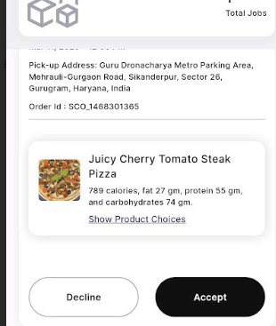

### Step 1: Subscription Creation by Vendor

### ##Step 1: Order Placement

The <strong>Order Placement</strong> screen allows vendors to add new subscription products by filling in the necessary details.

Below are the key fields in the form:

<ul>
  <li><strong>Subscription Name</strong>: A text field where the vendor enters the name of the subscription product.</li>
  <li><strong>Subscription Description</strong>: A text area where a brief description of the subscription product is provided.</li>
  <li><strong>Sub Category</strong>: A dropdown menu for selecting the relevant category under which the subscription falls.</li>
  <li><strong>Products</strong>: Two options are available:
    <ul>
      <li><strong>Fixed</strong>: A predefined product type with set attributes.</li>
      <li><strong>Flexible</strong>: A customizable product type that can have variations.</li>
    </ul>
  </li>
  <li><strong>Refundable Option</strong>: A radio button selection where the vendor can choose whether the product is refundable or non-refundable.</li>
  <li><strong>Payment Refund Privacy Policy</strong>: A mandatory section requiring the vendor to acknowledge the refund policy before proceeding.</li>
</ul>

Once all details are entered, the vendor clicks the <strong>Next</strong> button to proceed.

  

    
  

 

---

### ##Step 2: Setting the frequency of the products

The <strong>Edit Subscription Product</strong> screen allows vendors to modify product details in an ongoing subscription. This screen helps define the delivery frequency and total duration of the subscription.

<strong>Form Fields:</strong>

<ul>
  <li><strong>No. of products per day:</strong> A numeric input field where vendors specify how many products should be delivered daily.</li>
  <li><strong>Days Selection:</strong> A set of circular buttons representing the days of the week. Vendors can select specific days when the product should be delivered.</li>
  <li><strong>Number of Days:</strong> A numeric input field indicating the number of days one cycle of Subscription Orders.</li>
  <li><strong>Note:</strong> A disclaimer at the bottom states that the vendor cannot edit the number of products per day and the total subscription duration.</li>
</ul>

At the bottom, there are two action buttons:

<ul>
  <li><strong>Next:</strong> Proceeds to the next step in the subscription modification process.</li>
</ul>

  

    
  

 

---

### ##Step 3: Setting Pickup Location

When creating a pickup subscription, vendors must specify the pickup location:

<strong>Booking Details Screen:</strong>

<ul>
  <li><strong>Location Details:</strong>
    <ul>
      <li>Clear overview of the location setup process</li>
      <li>Interactive map with location marker</li>
      <li>Helpful description for easy navigation</li>
    </ul>
  </li>
  <li><strong>Address Components:</strong>
    <ul>
      <li>Pickup Location field</li>
      <li>Customer name display</li>
      <li>Full address with city and state</li>
      <li>Country information (e.g., India)</li>
    </ul>
  </li>
</ul>

<strong>Map Features:</strong>

<ul>
  <li>Red location marker for exact pickup point</li>
  <li>Visible street names and landmarks</li>
  <li>Zoomable view for precise location selection</li>
  <li>Easy navigation reference for customers</li>
</ul>

<strong>Confirmation Steps:</strong>

<ul>
  <li>Review entered location details</li>
  <li>"Confirm" button to save location</li>
  <li>Location saved and linked to subscription</li>
</ul>

  

    
  

 

---

### ##Step 4: Setting up the products for each days

The <strong>Edit Subscription Product - Make Schedule</strong> screen allows vendors to schedule specific products for each day of the subscription plan.

<strong>Form Fields:</strong>

<ul>
  <li><strong>Day Selection:</strong> Displays the current day being configured (e.g., <strong>Day 1</strong>).</li>
  <li><strong>Product 1:</strong> A dropdown menu where vendors can select the first product for the selected day. The chosen product in this image is <em>Sandwiches - Healthy Lab On-The-Go Egg Toast</em>.</li>
  <li><strong>Swap Option (Product 1):</strong> An additional field that allows vendors to specify an alternative product.</li>
  <li><strong>Product 2:</strong> A dropdown menu where vendors can select the second product for the selected day. The chosen product in this image is <em>Fresh Juices - Super Green Detox Juice</em>.</li>
  <li><strong>Swap Option (Product 2):</strong> An additional field that allows vendors to specify an alternative product.</li>
</ul>

<strong>Action Buttons:</strong>

<ul>
  <li><strong>Next:</strong> Moves to the next step in the subscription scheduling process.</li>
</ul>

  

    
  

 

---

### ##Step 5: Setting up the validation and add on for the products.

The <strong>Add New Subscription Product</strong> screen enables vendors to create and customize subscription offerings, allowing flexible pricing and optional add-ons.

<strong>Form Fields:</strong>

<ul>
  <li><strong>Number of Days:</strong> Specifies the duration of the subscription (e.g., <strong>30 days</strong>).</li>
  <li><strong>Validity Price:</strong> Sets the total cost for the specified duration (e.g., <strong>OMR 200</strong>).</li>
  <li><strong>Add Variations:</strong> Allows vendors to create multiple pricing or duration options.</li>
  <li><strong>Remove:</strong> Deletes the variation if no longer needed.</li>
</ul>

<strong>Choice Group Details:</strong>

Vendors can offer optional add-ons within the subscription, such as beverages or meal upgrades.

<ul>
  <li><strong>Choice Name:</strong> Defines the name of the add-on category (e.g., <strong>Beverages</strong>).</li>
  <li><strong>Minimum No. of Choices:</strong> The minimum number of selections required (e.g., <strong>0</strong>, meaning optional).</li>
  <li><strong>Maximum No. of Choices:</strong> The maximum number of selections allowed (e.g., <strong>3</strong>, meaning a customer can choose up to three options).</li>
</ul>

Vendors can create multiple <strong>Choice Groups</strong> for further customization, including side dishes, toppings, or combo sets.

<strong>Action Buttons:</strong>

<ul>
  <li><strong>Next:</strong> Proceeds to the next step in the subscription setup.</li>
</ul>

  

    
  

  

    
  

 

---

### ##Step 6: Choosing Delivery Type

After setting up the subscription details, vendors need to specify how customers will receive their orders. For pickup subscriptions:

<strong>Delivery Type Selection:</strong>

<ul>
  <li><strong>Options Available:</strong>
    <ul>
      <li>Delivery</li>
      <li>Pick up ✓</li>
      <li>Pick up & Delivery</li>
    </ul>
  </li>
  <li><strong>Pickup Configuration:</strong>
    <ul>
      <li>Select the "Pick up" checkbox only</li>
      <li>This indicates customers must collect orders from the store</li>
      <li>No delivery charges will be added to the subscription</li>
    </ul>
  </li>
  <li><strong>Important Notes:</strong>
    <ul>
      <li>Store location will be shown to customers</li>
      <li>Pickup times will be based on store operating hours</li>
      <li>Customers can only collect orders during specified pickup windows</li>
    </ul>
  </li>
</ul>

<strong>Action Buttons:</strong>

<ul>
  <li><strong>Ok:</strong> Confirms the pickup-only option</li>
  <li><strong>Cancel:</strong> Returns to previous screen without saving</li>
</ul>

  

    
  

 

---

### ##Step 7: Setting Lead Time and Branch Selection

The next steps follow the same process as Subscart Managed Delivery:

<ul>
  <li><strong>Lead Time Setup:</strong>
    <ul>
      <li>Set preparation time needed before pickup</li>
      <li>Configure when customers can modify their orders</li>
    </ul>
  </li>
  <li><strong>Branch Selection:</strong>
    <ul>
      <li>Choose which store locations will offer pickup service</li>
      <li>Set operating hours for each pickup location</li>
    </ul>
  </li>
</ul>

For detailed instructions on these steps, please refer to the Subscart Managed Delivery documentation.

 

---

## Step 2: Customer Perception

### ##Step 8: Order Verification Using QR Code

When customers access their pickup subscription order, they'll find a QR code verification system that ensures secure and efficient order collection:

<strong>Order Details Screen:</strong>

<ul>
  <li><strong>QR Code Display:</strong>
    <ul>
      <li>Prominently displayed in the top right corner</li>
      <li>Unique code generated for each order</li>
      <li>Must be shown to staff during pickup</li>
    </ul>
  </li>
  <li><strong>Order Information:</strong>
    <ul>
      <li>Pickup delivery status (e.g., "0/0 orders")</li>
      <li>Active subscription status indicator</li>
      <li>Purchase date and end date clearly shown</li>
    </ul>
  </li>
  <li><strong>Branch Details:</strong>
    <ul>
      <li>Pickup location name (e.g., "Aditya Branch 1")</li>
      <li>Number of active subscriptions</li>
      <li>Contact information:
        <ul>
          <li>Phone number</li>
          <li>Email address</li>
        </ul>
      </li>
    </ul>
  </li>
</ul>

<strong>Action Buttons:</strong>

<ul>
  <li><strong>Manage:</strong> Access subscription management options</li>
  <li><strong>Cancel Subscription:</strong> Option to cancel if needed</li>
</ul>

<strong>Pickup Process:</strong>

<ul>
  <li>Customer shows QR code to staff at pickup location</li>
  <li>Staff scans code to verify order authenticity</li>
  <li>Order is marked as collected in the system</li>
</ul>

  

    
  

 

---

### ##Step 9: Customer View of Pickup Subscription

When customers view a pickup subscription before purchase, they see a comprehensive overview of the subscription details:

<strong>Order Details:</strong>

<ul>
  <li><strong>Customer Information:</strong>
    <ul>
      <li>Customer name and order ID displayed at top</li>
      <li>Delivery Type clearly marked as "Pick-Up Only"</li>
      <li>Managed By: Vendor</li>
    </ul>
  </li>
  <li><strong>Product Details:</strong>
    <ul>
      <li>Product image and name (e.g., "Juicy Cherry Tomato Steak")</li>
      <li>Product status indicator (e.g., "Preparing")</li>
      <li>Nutritional information when available</li>
    </ul>
  </li>
  <li><strong>Schedule Information:</strong>
    <ul>
      <li>Weekly calendar showing available days (Sun through Sat)</li>
      <li>Pickup location address</li>
      <li>Pickup timing details</li>
    </ul>
  </li>
</ul>

<strong>Subscription Parameters:</strong>

<ul>
  <li><strong>Product:</strong> Flexible</li>
  <li><strong>Delivery:</strong> Flexible</li>
  <li><strong>Delivery By:</strong> Pick-Up Only</li>
  <li><strong>Lead Time:</strong> 1 Hour</li>
  <li><strong>Maximum Pause Time:</strong> 1 days</li>
</ul>

<strong>Pricing:</strong>

<ul>
  <li>Clear display of subscription price (OMR 20)</li>
  <li>No additional delivery charges</li>
  <li>"Buy Now" button shows total amount</li>
</ul>

  

    
  

 

---

## Step 3: Staff Gets the Subscription Orders

### ##Step 10: Staff Order Management

Before the lead time expires, staff members receive order details and must take action:

<strong>Order Information Display:</strong>

<ul>
  <li><strong>Order Header:</strong>
    <ul>
      <li>Total number of jobs to process</li>
      <li>Order ID (e.g., SCO.1468301365)</li>
      <li>Pickup location details</li>
    </ul>
  </li>
  <li><strong>Location Details:</strong>
    <ul>
      <li>Complete pickup address</li>
      <li>Area and landmark information</li>
      <li>City and state details</li>
    </ul>
  </li>
  <li><strong>Product Information:</strong>
    <ul>
      <li>Product image and name (e.g., "Juicy Cherry Tomato Steak Pizza")</li>
      <li>Nutritional information:
        <ul>
          <li>Calories: 769</li>
          <li>Fat: 27 gm</li>
          <li>Protein: 55 gm</li>
          <li>Carbohydrates: 74 gm</li>
        </ul>
      </li>
      <li>"Show Product Choices" option for any customizations</li>
    </ul>
  </li>
</ul>

<strong>Action Buttons:</strong>

<ul>
  <li><strong>Accept:</strong> Confirm order preparation will begin</li>
  <li><strong>Decline:</strong> Reject order if unable to fulfill</li>
</ul>

<strong>Important Notes:</strong>

<ul>
  <li>Staff must respond before lead time expires</li>
  <li>Accepting confirms commitment to prepare order</li>
  <li>Customer is notified of staff's response</li>
</ul>

  

    
  

 

---

### ##Step 11: Order Status Management

After accepting the order, staff members can update the order status through the "Change Status" section:

<strong>Status Options:</strong>

<ul>
  <li><strong>Preparing:</strong>
    <ul>
      <li>Initial status when order preparation begins</li>
      <li>Indicates kitchen staff has started working on the order</li>
      <li>Customer can track that their order is being prepared</li>
    </ul>
  </li>
  <li><strong>Ready:</strong>
    <ul>
      <li>Order is complete and ready for pickup</li>
      <li>Customer is notified that they can collect their order</li>
      <li>Staff awaits customer arrival with QR code</li>
    </ul>
  </li>
  <li><strong>In Delivery:</strong>
    <ul>
      <li>For pickup orders, this indicates the order is with front staff</li>
      <li>Used when order is moved from kitchen to pickup counter</li>
      <li>Final stage before customer collection</li>
    </ul>
  </li>
</ul>

<strong>Status Flow:</strong>

<ul>
  <li>Status must be updated in sequence: Preparing → Ready → In Delivery</li>
  <li>Each status change triggers customer notification</li>
  <li>Status updates help coordinate between kitchen and front staff</li>
</ul>

<strong>Order Details Display:</strong>

<ul>
  <li>Customer name and order ID always visible</li>
  <li>Pickup location and timing information</li>
  <li>Current status prominently displayed</li>
  <li>Product details and specifications shown</li>
</ul>

  

    
  

 

---

### ##Step 12: Marking Order as Ready

When the order preparation is complete, staff members update the order status to "Ready":

<strong>Ready Status Process:</strong>

<ul>
  <li><strong>Status Update:</strong>
    <ul>
      <li>Staff changes status from "Preparing" to "Ready"</li>
      <li>Status change is immediately reflected in the system</li>
      <li>Green indicator shows order is ready for pickup</li>
    </ul>
  </li>
  <li><strong>Customer Notification:</strong>
    <ul>
      <li>Automatic notification sent to customer</li>
      <li>Customer can view exact pickup location</li>
      <li>Pickup time window is displayed</li>
    </ul>
  </li>
  <li><strong>Staff Actions:</strong>
    <ul>
      <li>Order is moved to pickup area</li>
      <li>Staff prepares for QR code verification</li>
      <li>Order details remain accessible for verification</li>
    </ul>
  </li>
</ul>

<strong>Order Information Display:</strong>

<ul>
  <li>Order status prominently shows "Ready"</li>
  <li>All order details remain visible:
    <ul>
      <li>Customer name and order ID</li>
      <li>Product details and specifications</li>
      <li>Pickup location information</li>
    </ul>
  </li>
</ul>

  

    
  

 

---

### ##Step 13: Order Completion Process

When the customer arrives for pickup, the final verification and completion process begins:

<strong>QR Code Verification:</strong>

<ul>
  <li><strong>Customer Presentation:</strong>
    <ul>
      <li>Customer shows QR code from their order screen</li>
      <li>Staff scans code using the system</li>
      <li>Order details are instantly retrieved</li>
    </ul>
  </li>
  <li><strong>Order Details Display:</strong>
    <ul>
      <li>Subscription type: "7 days pickup"</li>
      <li>Order status: "Active"</li>
      <li>Current order count: "0/1 Orders"</li>
    </ul>
  </li>
</ul>

<strong>Order Information:</strong>

<ul>
  <li><strong>Timing Details:</strong>
    <ul>
      <li>Order date: Mar 11, 2025</li>
      <li>Pickup frequency: 7 days pickup</li>
      <li>Validity information displayed</li>
    </ul>
  </li>
  <li><strong>Location Information:</strong>
    <ul>
      <li>Complete pickup address</li>
      <li>Price details (OMR 30)</li>
    </ul>
  </li>
</ul>

<strong>Completion Process:</strong>

<ul>
  <li>Staff verifies order details match the prepared items</li>
  <li>"Complete Order" button becomes available</li>
  <li>Clicking completes the current pickup cycle</li>
  <li>System updates subscription status automatically</li>
</ul>

  

    
  

 

---

### ##Step 14: Order Completion Confirmation

After clicking the "Complete Order" button, staff members will see a confirmation screen:

<strong>Success Screen Elements:</strong>

<ul>
  <li><strong>Visual Confirmation:</strong>
    <ul>
      <li>Large green checkmark icon</li>
      <li>"Success!" message clearly displayed</li>
      <li>Confirmation text: "You have successfully completed your order"</li>
    </ul>
  </li>
  <li><strong>Action Required:</strong>
    <ul>
      <li>"Ok" button to acknowledge completion</li>
      <li>Returns to main order management screen when clicked</li>
      <li>System updates order status automatically</li>
    </ul>
  </li>
</ul>

<strong>System Updates:</strong>

<ul>
  <li>Order marked as completed in the system</li>
  <li>Customer subscription cycle updated</li>
  <li>Next pickup date calculated automatically</li>
  <li>Customer receives completion notification</li>
</ul>

  

    
  

 

---

### ##Step 15: Completed Orders View

After order completion, both staff and customers can view the order in their respective completed orders sections:

<strong>Customer App View:</strong>

<ul>
  <li><strong>Orders Tab Navigation:</strong>
    <ul>
      <li>Today's</li>
      <li>Upcoming</li>
      <li>Completed</li>
    </ul>
  </li>
  <li><strong>Order Details Display:</strong>
    <ul>
      <li>Product image and name</li>
      <li>Nutritional information</li>
      <li>Delivery type: Pick Up</li>
      <li>Status: "Picked"</li>
      <li>"Download PDF" option available</li>
      <li>"Rate your meal" feedback option</li>
    </ul>
  </li>
  <li><strong>Subscription Progress:</strong>
    <ul>
      <li>Order count updated (e.g., "1/1 orders")</li>
      <li>Active status indicator</li>
      <li>7 days pickup frequency shown</li>
    </ul>
  </li>
</ul>

<strong>Additional Information:</strong>

<ul>
  <li><strong>Order Details:</strong>
    <ul>
      <li>Unique ID displayed</li>
      <li>Purchase and end dates</li>
      <li>Branch details accessible</li>
      <li>"Manage" option for subscription settings</li>
    </ul>
  </li>
</ul>

  

    
  

  

    
  

