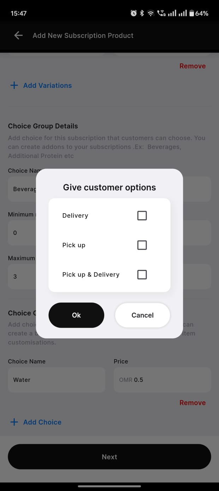
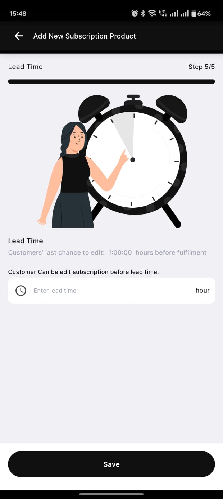
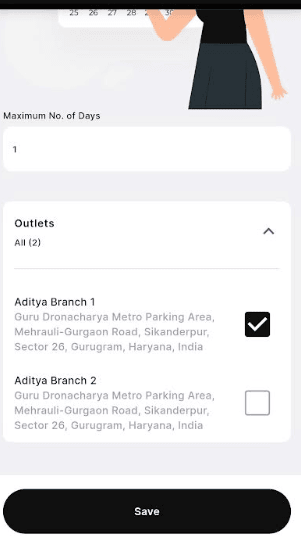
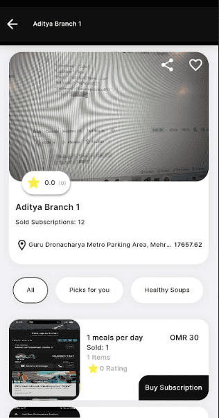
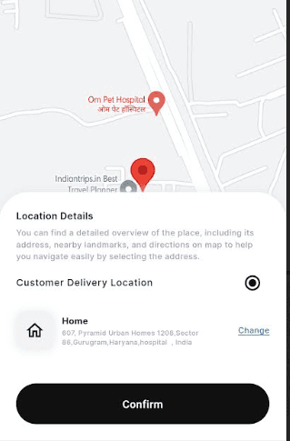
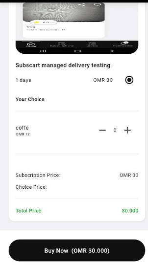
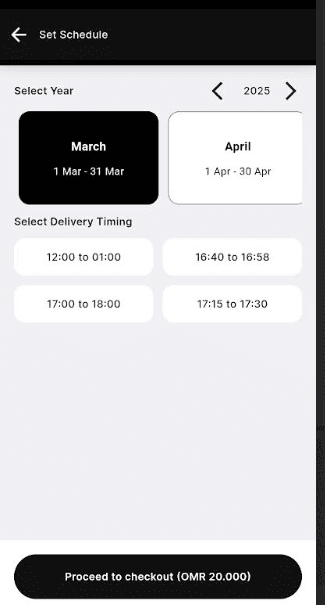
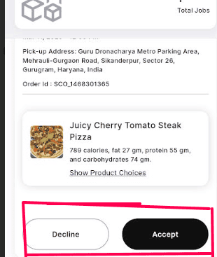
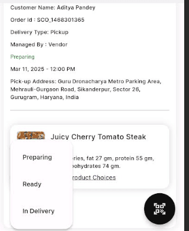

### Step 1: Subscription Creation

### ##Step 1: Order Placement

The <strong>Order Placement</strong> screen allows vendors to add new subscription products by filling in the necessary details.

Below are the key fields in the form:

<ul>
  <li><strong>Subscription Name</strong>: A text field where the vendor enters the name of the subscription product.</li>
  <li><strong>Subscription Description</strong>: A text area where a brief description of the subscription product is provided.</li>
  <li><strong>Sub Category</strong>: A dropdown menu for selecting the relevant category under which the subscription falls.</li>
  <li><strong>Products</strong>: Two options are available:
    <ul>
      <li><strong>Fixed</strong>: A predefined product type with set attributes.</li>
      <li><strong>Flexible</strong>: A customizable product type that can have variations.</li>
    </ul>
  </li>
  <li><strong>Refundable Option</strong>: A radio button selection where the vendor can choose whether the product is refundable or non-refundable.</li>
  <li><strong>Payment Refund Privacy Policy</strong>: A mandatory section requiring the vendor to acknowledge the refund policy before proceeding.</li>
</ul>

Once all details are entered, the vendor clicks the <strong>Next</strong> button to proceed.

  

---

### ##Step 2: Setting the frequency of the products

The <strong>Edit Subscription Product</strong> screen allows vendors to modify product details in an ongoing subscription. This screen helps define the delivery frequency and total duration of the subscription.

<strong>Form Fields:</strong>

<ul>
  <li><strong>No. of products per day:</strong> A numeric input field where vendors specify how many products should be delivered daily.</li>
  <li><strong>Days Selection:</strong> A set of circular buttons representing the days of the week. Vendors can select specific days when the product should be delivered.</li>
  <li><strong>Number of Days:</strong> A numeric input field indicating the total duration (in days) for which the subscription is active.</li>
  <li><strong>Note:</strong> A disclaimer at the bottom states that the vendor cannot edit the number of products per day and the total subscription duration.</li>
</ul>

At the bottom, there are two action buttons:

<ul>
  <li><strong>Next:</strong> Proceeds to the next step in the subscription modification process.</li>
</ul>

  

---

### ##Step 3: Setting up the products for each days

The <strong>Edit Subscription Product - Make Schedule</strong> screen allows vendors to schedule specific products for each day of the subscription plan.

<strong>Form Fields:</strong>

<ul>
  <li><strong>Day Selection:</strong> Displays the current day being configured (e.g., <strong>Day 1</strong>).</li>
  <li><strong>Product 1:</strong> A dropdown menu where vendors can select the first product for the selected day. The chosen product in this image is <em>Sandwiches - Healthy Lab On-The-Go Egg Toast</em>.</li>
  <li><strong>Swap Option (Product 1):</strong> An additional field that allows vendors to specify an alternative product.</li>
  <li><strong>Product 2:</strong> A dropdown menu where vendors can select the second product for the selected day. The chosen product in this image is <em>Fresh Juices - Super Green Detox Juice</em>.</li>
  <li><strong>Swap Option (Product 2):</strong> An additional field that allows vendors to specify an alternative product.</li>
</ul>

<strong>Action Buttons:</strong>

<ul>
  <li><strong>Next:</strong> Moves to the next step in the subscription scheduling process.</li>
</ul>

  

--- 

### ##Step 4: Setting up the validation and add on for the products.

The <strong>Add New Subscription Product</strong> screen enables vendors to create and customize subscription offerings, allowing flexible pricing and optional add-ons.

<strong>Form Fields:</strong>

<ul>
  <li><strong>Number of Days:</strong> Specifies the duration of the subscription (e.g., <strong>30 days</strong>).</li>
  <li><strong>Validity Price:</strong> Sets the total cost for the specified duration (e.g., <strong>OMR 200</strong>).</li>
  <li><strong>Add Variations:</strong> Allows vendors to create multiple pricing or duration options.</li>
  <li><strong>Remove:</strong> Deletes the variation if no longer needed.</li>
</ul>

<strong>Choice Group Details:</strong>

Vendors can offer optional add-ons within the subscription, such as beverages or meal upgrades.

<ul>
  <li><strong>Choice Name:</strong> Defines the name of the add-on category (e.g., <strong>Beverages</strong>).</li>
  <li><strong>Minimum No. of Choices:</strong> The minimum number of selections required (e.g., <strong>0</strong>, meaning optional).</li>
  <li><strong>Maximum No. of Choices:</strong> The maximum number of selections allowed (e.g., <strong>3</strong>, meaning a customer can choose up to three options).</li>
</ul>

Vendors can create multiple <strong>Choice Groups</strong> for further customization, including side dishes, toppings, or combo sets.

<strong>Action Buttons:</strong>

<ul>
  <li><strong>Next:</strong> Proceeds to the next step in the subscription setup.</li>
</ul>

  
  

---

### ##Step 5: Choosing Delivery Type

The <strong>Give Customer Options</strong> popup allows vendors to specify how customers can receive their subscription products.

<strong>Options Available:</strong>

<ul>
  <li><strong>Delivery:</strong> Customers will receive their orders via delivery.</li>
  <li><strong>Pick up:</strong> Customers can collect their orders from the vendor's location.</li>
  <li><strong>Pick up & Delivery:</strong> A flexible option allowing both pick-up and delivery to the customer.</li>
</ul>

<strong>Subscart Managed Delivery:</strong>

When vendors select the <strong>Delivery</strong> option, an additional prompt appears asking if they want <strong>Subscart</strong> to fulfill the deliveries.

<ul>
  <li>If the vendor chooses <strong>Yes</strong>, the subscription is marked as a <strong>Subscart Delivery-Based Subscription</strong>.</li>
  <li>This means that Subscart will handle all logistics and ensure timely deliveries to customers.</li>
</ul>

<strong>Action Buttons:</strong>

<ul>
  <li><strong>Ok:</strong> Confirms the selection.</li>
  <li><strong>Cancel:</strong> Discards the changes.</li>
</ul>

  

---

### ##Step 6: Setting up the lead time

The <strong>Lead Time Configuration</strong> screen allows vendors to set a time limit for customers to modify their subscription before fulfillment.

<strong>Key Features:</strong>

<ul>
  <li><strong>Lead Time Input:</strong> Vendors can specify the number of hours before fulfillment when customers can still edit their subscription.</li>
  <li><strong>Informational Message:</strong> Displays a message indicating the last chance for customers to edit their subscription.</li>
</ul>

<strong>Customer Subscription Edit Restriction:</strong>

Customers will only be able to edit their subscriptions before the set lead time.

<ul>
  <li>For example, if the lead time is set to <strong>1 hour</strong>, customers can modify their order up to an hour before fulfillment.</li>
  <li>After the lead time has passed, modifications will be locked.</li>
</ul>

<strong>Action Buttons:</strong>

<ul>
  <li><strong>Save:</strong> Confirms and saves the lead time configuration.</li>
</ul>

  

---

### ##Step 7: Setting pause days

The <strong>Pause Subscription Configuration</strong> screen allows vendors to set a maximum number of days for which customers can pause their subscription and select applicable outlets.

<strong>Key Features:</strong>

<ul>
  <li><strong>Maximum No. of Days Input:</strong> Vendors can specify the maximum duration (in days) a subscription can be paused.</li>
  <li><strong>Outlet Selection:</strong> Vendors can select one or multiple outlets where the pause functionality applies and Subscribers can buy subscriptions from.</li>
</ul>

<strong>Outlet Selection Behavior:</strong>

Vendors can choose specific outlets where customers are allowed to pause their subscriptions and take deliveries from.

<ul>
  <li>A selected outlet is marked with a <strong>checked checkbox</strong>.</li>
  <li>Unselected outlets remain unchecked and do not support subscription pauses.</li>
</ul>

<strong>Action Buttons:</strong>

<ul>
  <li><strong>Save:</strong> Confirms and saves the pause duration and selected outlets.</li>
  <li>After this it's sent for admin approval</li>
</ul>

  

---

### Step 2: Customer Buys Subscription

### ##Step 1: Discovering Subscriptions

The <strong>Subscription Discovery</strong> screen allows customers to explore available subscription options from different vendors.

<strong>Key Features:</strong>

<ul>
  <li><strong>Vendor Details:</strong> Displays vendor name, location, and number of subscriptions sold.</li>
  <li><strong>Rating System:</strong> Customers can see the vendor's rating, represented by a star-based system.</li>
  <li><strong>Categories:</strong> Customers can filter subscriptions based on categories such as <strong>Picks for you</strong> and <strong>Healthy Soups</strong>.</li>
  <li><strong>Subscription Plans:</strong> Displays available meal subscription plans with details like:
    <ul>
      <li>Meal frequency (e.g., <strong>1 meal per day</strong>).</li>
      <li>Price (e.g., <strong>OMR 30</strong>).</li>
      <li>Items included in the plan.</li>
      <li>Number of times the plan has been sold.</li>
      <li>Customer ratings for the subscription.</li>
    </ul>
  </li>
</ul>

<strong>Action Buttons:</strong>

<ul>
  <li><strong>Buy Subscription:</strong> Allows customers to proceed with purchasing the selected subscription plan.</li>
</ul>

  

--- 

### ##Step 2: Customer Buys Subscription

The <strong>Subscription Details</strong> screen provides customers with detailed information about a selected meal subscription.

<strong>Key Features:</strong>

<ul>
  <li><strong>Subscription Plan:</strong> Displays the name of the plan (e.g., <strong>1 meal per day</strong>).</li>
  <li><strong>Pricing:</strong> Shows the cost of the plan (e.g., <strong>OMR 1.5</strong> per meal).</li>
  <li><strong>Delivery Schedule:</strong> Customers can choose the days they want to receive meals (e.g., Sunday to Saturday selection).</li>
  <li><strong>Subscription Properties:</strong></li>
  <ul>
    <li><strong>Product:</strong> Indicates whether the subscription is flexible.</li>
    <li><strong>Delivery:</strong> Specifies if delivery options are flexible.</li>
    <li><strong>Delivery By:</strong> Defines whether deliveries are managed by the vendor or <strong>Subscart</strong>.</li>
    <li><strong>Delivery Mode:</strong> States if the subscription is <strong>Delivery Only</strong>.</li>
    <li><strong>Lead Time:</strong> Shows the time required to process the order (e.g., <strong>1 Hour</strong>).</li>
    <li><strong>Maximum Pause Time:</strong> Displays the number of days a customer can pause their subscription (e.g., <strong>1 day</strong>).</li>
  </ul>
</ul>

<strong>Action Button:</strong>

<ul>
  <li><strong>Buy Now (OMR 1.5):</strong> Allows customers to purchase the subscription immediately.</li>
</ul>

  

---

### ##Step 3: Customer Select Delivery Location

The <strong>Delivery Location Selection</strong> screen allows customers to choose or update their preferred delivery address.

<strong>Key Features:</strong>

<ul>
  <li><strong>Location Overview:</strong> Displays a map with pinned locations to help customers visualize their delivery address.</li>
  <li><strong>Address Details:</strong> Provides a detailed description of the selected location, including address, landmarks, and directions.</li>
  <li><strong>Customer Delivery Location:</strong> Shows the saved delivery address (e.g., <strong>Home - 607, Pyramid Urban Homes, Sector 86, Gurugram, India</strong>).</li>
  <li><strong>Change Option:</strong> Allows customers to update their delivery address if needed.</li>
</ul>

<strong>Action Button:</strong>

<ul>
  <li><strong>Confirm:</strong> Finalizes the selected delivery location and proceeds with the order.</li>
</ul>

  

---

Step 4: Customer Confirm Subscription

The <strong>Subscription Price Breakdown</strong> screen allows customers to review their subscription details, additional choices, and the total price before proceeding with the purchase.

<strong>Key Features:</strong>

<ul>
  <li><strong>Subscription Plan:</strong> Displays the selected subscription type (e.g., <strong>Subscart Managed Delivery Testing</strong>).</li>
  <li><strong>Duration & Price:</strong> Shows the subscription duration (e.g., <strong>1 day</strong>) and the base price (e.g., <strong>OMR 30</strong>).</li>
  <li><strong>Your Choice Section:</strong> Allows customers to add extra items to their subscription (e.g., <strong>Coffee - OMR 12</strong>).</li>
  <li><strong>Quantity Selector:</strong> Customers can increase or decrease the quantity of optional add-ons.</li>
  <li><strong>Price Breakdown:</strong>
    <ul>
      <li><strong>Subscription Price:</strong> Displays the base subscription cost.</li>
      <li><strong>Choice Price:</strong> Shows the additional cost of selected extras.</li>
      <li><strong>Total Price:</strong> Reflects the final amount payable.</li>
    </ul>
  </li>
</ul>

<strong>Action Button:</strong>

<ul>
  <li><strong>Buy Now:</strong> Confirms the selection and proceeds to payment.</li>
</ul>

  

---

### ##Step 4: Customer Confirms Timings

The <strong>Set Schedule & Delivery Timing</strong> screen allows customers to select their preferred delivery date and time slot for their subscription orders, ensuring flexibility and convenience.

<strong>Key Features:</strong>

<ul>
  <li><strong>Delivery Timing Selection:</strong>
    <ul>
      <li>Customers can pick a preferred delivery time from the available slots.</li>
      <li>Time slots are displayed as easy-to-select buttons.</li>
    </ul>
  </li>
  <li><strong>Checkout Summary:</strong>
    <ul>
      <li>Displays the <strong>total price</strong> before proceeding to checkout.</li>
      <li>Example: <strong>OMR 20.000</strong> is shown at the bottom.</li>
    </ul>
  </li>
</ul>

<strong>Action Button:</strong>

<ul>
  <li><strong>Proceed to Checkout:</strong> Finalizes the selection and moves the user to the payment process.</li>
</ul>

  

---

### Step 3: Staff Gets the Subscription Orders

### ##Step 1: Staff Gets the Subscription Orders

The <strong>Staff Order Request & Status Update</strong> screen allows staff members to review incoming orders and take appropriate action within the designated lead time before the request expires.

<strong>Key Features:</strong>

<ul>
  <li><strong>Order Details:</strong>
    <ul>
      <li>Displays the <strong>pickup address</strong> and <strong>order ID</strong> for easy identification.</li>
      <li>Shows the ordered item details, including name (e.g., <strong>Juicy Cherry Tomato Steak Pizza</strong>), calorie count, and macronutrient breakdown.</li>
    </ul>
  </li>
  <li><strong>Action Buttons:</strong>
    <ul>
      <li><strong>Accept:</strong> The staff confirms the order and proceeds with preparation.</li>
      <li><strong>Decline:</strong> The staff rejects the order if they are unable to fulfill it.</li>
    </ul>
  </li>
  <li><strong>Lead Time Notification:</strong>
    <ul>
      <li>Staff receives a notification within the lead time set by the vendor.</li>
      <li>They must respond before the lead expires.</li>
    </ul>
  </li>
  <li><strong>Status Update Requirement:</strong>
    <ul>
      <li>Before starting preparation, staff must use the <strong>"Change Status"</strong> option.</li>
      <li>They should mark the order as <strong>"Preparing"</strong> to update its status in the system.</li>
      <li>After marking the order as <strong>"Preparing"</strong>, the order will be moved to the <strong>"Preparing"</strong> section.</li>
    </ul>
  </li>
</ul>

  
  

