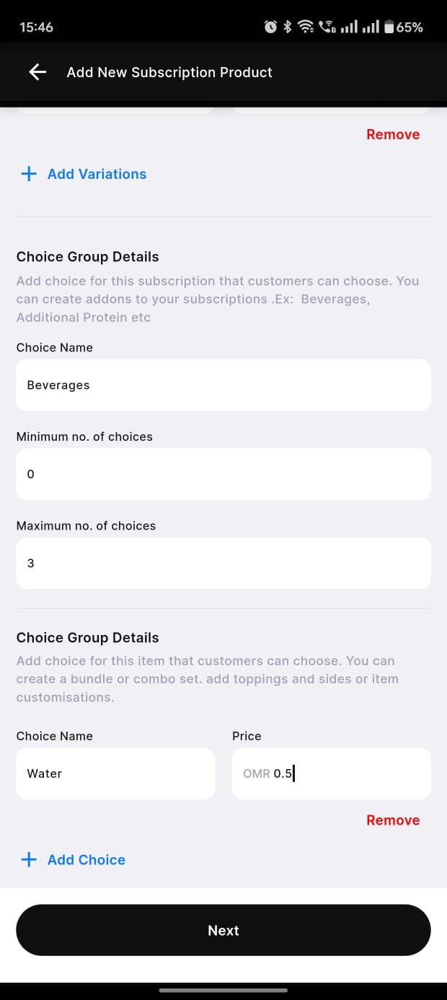
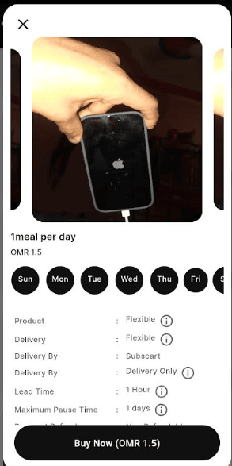

### Step 1: Subscription Creation

### ##Step 1: Order Placement

The <strong>Order Placement</strong> screen allows vendors to add new subscription products by filling in the necessary details.

Below are the key fields in the form:

<ul>
  <li><strong>Subscription Name</strong>: A text field where the vendor enters the name of the subscription product.</li>
  <li><strong>Subscription Description</strong>: A text area where a brief description of the subscription product is provided.</li>
  <li><strong>Sub Category</strong>: A dropdown menu for selecting the relevant category under which the subscription falls.</li>
  <li><strong>Products</strong>: Two options are available:
    <ul>
      <li><strong>Fixed</strong>: A predefined product type with set attributes.</li>
      <li><strong>Flexible</strong>: A customizable product type that can have variations.</li>
    </ul>
  </li>
  <li><strong>Refundable Option</strong>: A radio button selection where the vendor can choose whether the product is refundable or non-refundable.</li>
  <li><strong>Payment Refund Privacy Policy</strong>: A mandatory section requiring the vendor to acknowledge the refund policy before proceeding.</li>
</ul>

Once all details are entered, the vendor clicks the <strong>Next</strong> button to proceed.

  

---

### ##Step 2: Setting the frequency of the products

The <strong>Edit Subscription Product</strong> screen allows vendors to modify product details in an ongoing subscription. This screen helps define the delivery frequency and total duration of the subscription.

<strong>Form Fields:</strong>

<ul>
  <li><strong>No. of products per day:</strong> A numeric input field where vendors specify how many products should be delivered daily.</li>
  <li><strong>Days Selection:</strong> A set of circular buttons representing the days of the week. Vendors can select specific days when the product should be delivered.</li>
  <li><strong>Number of Days:</strong> A numeric input field indicating the number of days one cycle of Subscription Orders.</li>
  <li><strong>Note:</strong> A disclaimer at the bottom states that the vendor cannot edit the number of products per day and the total subscription duration.</li>
</ul>

At the bottom, there are two action buttons:

<ul>
  <li><strong>Next:</strong> Proceeds to the next step in the subscription modification process.</li>
</ul>

  

---

### ##Step 3: Setting up the products for each days

The <strong>Edit Subscription Product - Make Schedule</strong> screen allows vendors to schedule specific products for each day of the subscription plan.

<strong>Form Fields:</strong>

<ul>
  <li><strong>Day Selection:</strong> Displays the current day being configured (e.g., <strong>Day 1</strong>).</li>
  <li><strong>Product 1:</strong> A dropdown menu where vendors can select the first product for the selected day. The chosen product in this image is <em>Sandwiches - Healthy Lab On-The-Go Egg Toast</em>.</li>
  <li><strong>Swap Option (Product 1):</strong> An additional field that allows vendors to specify an alternative product.</li>
  <li><strong>Product 2:</strong> A dropdown menu where vendors can select the second product for the selected day. The chosen product in this image is <em>Fresh Juices - Super Green Detox Juice</em>.</li>
  <li><strong>Swap Option (Product 2):</strong> An additional field that allows vendors to specify an alternative product.</li>
</ul>

<strong>Action Buttons:</strong>

<ul>
  <li><strong>Next:</strong> Moves to the next step in the subscription scheduling process.</li>
</ul>

  

---

### ##Step 4: Setting up the validation and add on for the products.

The <strong>Add New Subscription Product</strong> screen enables vendors to create and customize subscription offerings, allowing flexible pricing and optional add-ons.

<strong>Form Fields:</strong>

<ul>
  <li><strong>Number of Days:</strong> Specifies the duration of the subscription (e.g., <strong>30 days</strong>).</li>
  <li><strong>Validity Price:</strong> Sets the total cost for the specified duration (e.g., <strong>OMR 200</strong>).</li>
  <li><strong>Add Variations:</strong> Allows vendors to create multiple pricing or duration options.</li>
  <li><strong>Remove:</strong> Deletes the variation if no longer needed.</li>
</ul>

<strong>Choice Group Details:</strong>

Vendors can offer optional add-ons within the subscription, such as beverages or meal upgrades.

<ul>
  <li><strong>Choice Name:</strong> Defines the name of the add-on category (e.g., <strong>Beverages</strong>).</li>
  <li><strong>Minimum No. of Choices:</strong> The minimum number of selections required (e.g., <strong>0</strong>, meaning optional).</li>
  <li><strong>Maximum No. of Choices:</strong> The maximum number of selections allowed (e.g., <strong>3</strong>, meaning a customer can choose up to three options).</li>
</ul>

Vendors can create multiple <strong>Choice Groups</strong> for further customization, including side dishes, toppings, or combo sets.

<strong>Action Buttons:</strong>

<ul>
  <li><strong>Next:</strong> Proceeds to the next step in the subscription setup.</li>
</ul>

  
  

---

### ##Step 5: Choosing Delivery Type

The <strong>Give Customer Options</strong> popup allows vendors to specify how customers can receive their subscription products.

<strong>Options Available:</strong>

<ul>
  <li><strong>Delivery:</strong> Customers will receive their orders via delivery.</li>
  <li><strong>Pick up:</strong> Customers can collect their orders from the vendor's location.</li>
  <li><strong>Pick up & Delivery:</strong> A flexible option allowing both pick-up and delivery to the customer.</li>
</ul>

<strong>Subscart Managed Delivery:</strong>

When vendors select the <strong>Delivery</strong> option, an additional prompt appears asking if they want <strong>Subscart</strong> to fulfill the deliveries.

<ul>
  <li>If the vendor chooses <strong>Yes</strong>, the subscription is marked as a <strong>Subscart Delivery-Based Subscription</strong>.</li>
  <li>This means that Subscart will handle all logistics and ensure timely deliveries to customers.</li>
</ul>

<strong>Action Buttons:</strong>

<ul>
  <li><strong>Ok:</strong> Confirms the selection.</li>
  <li><strong>Cancel:</strong> Discards the changes.</li>
</ul>

  

---

### ##Delivery Type Options

When setting up a subscription, vendors can choose from three delivery options to offer their customers:

 

<strong>1. Delivery:</strong>

<ul>
  <li><strong>Features:</strong>
    <ul>
      <li>Products delivered directly to customer's address</li>
      <li>Managed by Subscart's delivery network</li>
      <li>Includes delivery charges in subscription price</li>
      <li>Real-time delivery tracking available</li>
    </ul>
  </li>
  <li><strong>Best For:</strong>
    <ul>
      <li>Customers who prefer home delivery</li>
      <li>Businesses without delivery infrastructure</li>
      <li>Wide delivery radius coverage</li>
    </ul>
  </li>
</ul>

 

<strong>2. Pick-up:</strong>

<ul>
  <li><strong>Features:</strong>
    <ul>
      <li>Customers collect orders from store location</li>
      <li>No delivery charges</li>
      <li>Flexible pickup windows</li>
      <li>QR code verification system</li>
    </ul>
  </li>
  <li><strong>Best For:</strong>
    <ul>
      <li>Local customers</li>
      <li>Cost-conscious subscribers</li>
      <li>Immediate order collection</li>
    </ul>
  </li>
</ul>

 

<strong>3. Pick-up & Delivery:</strong>

<ul>
  <li><strong>Features:</strong>
    <ul>
      <li>Customers can choose between pickup or delivery</li>
      <li>Flexible pricing based on choice</li>
      <li>Combined benefits of both options</li>
      <li>Maximum flexibility for customers</li>
    </ul>
  </li>
  <li><strong>Best For:</strong>
    <ul>
      <li>Businesses with diverse customer base</li>
      <li>Flexible service requirements</li>
      <li>Optimizing customer satisfaction</li>
    </ul>
  </li>
</ul>

  

    
  

---

### ##Step 6: Setting up the lead time

The <strong>Lead Time Configuration</strong> screen allows vendors to set a time limit for customers to modify their subscription before fulfillment.

<strong>Key Features:</strong>

<ul>
  <li><strong>Lead Time Input:</strong> Vendors can specify the number of hours before fulfillment when customers can still edit their subscription.</li>
  <li><strong>Informational Message:</strong> Displays a message indicating the last chance for customers to edit their subscription.</li>
</ul>

<strong>Customer Subscription Edit Restriction:</strong>

Customers will only be able to edit their subscriptions before the set lead time.

<ul>
  <li>For example, if the lead time is set to <strong>1 hour</strong>, customers can modify their order up to an hour before fulfillment.</li>
  <li>After the lead time has passed, modifications will be locked.</li>
</ul>

<strong>Action Buttons:</strong>

<ul>
  <li><strong>Save:</strong> Confirms and saves the lead time configuration.</li>
</ul>

  

---

### ##Step 7: Setting pause days

The <strong>Pause Subscription Configuration</strong> screen allows vendors to set a maximum number of days for which customers can pause their subscription and select applicable outlets.

<strong>Key Features:</strong>

<ul>
  <li><strong>Maximum No. of Days Input:</strong> Vendors can specify the maximum duration (in days) a subscription can be paused.</li>
  <li><strong>Outlet Selection:</strong> Vendors can select one or multiple outlets where the pause functionality applies and Subscribers can buy subscriptions from.</li>
</ul>

<strong>Outlet Selection Behavior:</strong>

Vendors can choose specific outlets where customers are allowed to pause their subscriptions and take deliveries from.

<ul>
  <li>A selected outlet is marked with a <strong>checked checkbox</strong>.</li>
  <li>Unselected outlets remain unchecked and do not support subscription pauses.</li>
</ul>

<strong>Action Buttons:</strong>

<ul>
  <li><strong>Save:</strong> Confirms and saves the pause duration and selected outlets.</li>
  <li>After this it's sent for admin approval</li>
</ul>

  

---

### Step 2: Customer Buys Subscription

### ##Step 1: Discovering Subscriptions

The <strong>Subscription Discovery</strong> screen allows customers to explore available subscription options from different vendors.

<strong>Key Features:</strong>

<ul>
  <li><strong>Vendor Details:</strong> Displays vendor name, location, and number of subscriptions sold.</li>
  <li><strong>Rating System:</strong> Customers can see the vendor's rating, represented by a star-based system.</li>
  <li><strong>Categories:</strong> Customers can filter subscriptions based on categories such as <strong>Picks for you</strong> and <strong>Healthy Soups</strong>.</li>
  <li><strong>Subscription Plans:</strong> Displays available meal subscription plans with details like:
    <ul>
      <li>Meal frequency (e.g., <strong>1 meal per day</strong>).</li>
      <li>Price (e.g., <strong>OMR 30</strong>).</li>
      <li>Items included in the plan.</li>
      <li>Number of times the plan has been sold.</li>
      <li>Customer ratings for the subscription.</li>
    </ul>
  </li>
</ul>

<strong>Action Buttons:</strong>

<ul>
  <li><strong>Buy Subscription:</strong> Allows customers to proceed with purchasing the selected subscription plan.</li>
</ul>

  

---

### ##Step 2: Customer Buys Subscription

The <strong>Subscription Details</strong> screen provides customers with detailed information about a selected meal subscription.

<strong>Key Features:</strong>

<ul>
  <li><strong>Subscription Plan:</strong> Displays the name of the plan (e.g., <strong>1 meal per day</strong>).</li>
  <li><strong>Pricing:</strong> Shows the cost of the plan (e.g., <strong>OMR 1.5</strong> per meal).</li>
  <li><strong>Delivery Schedule:</strong> Customers can choose the days they want to receive meals (e.g., Sunday to Saturday selection).</li>
  <li><strong>Subscription Properties:</strong></li>
  <ul>
    <li><strong>Product:</strong> Indicates whether the subscription is flexible.</li>
    <li><strong>Delivery:</strong> Specifies if delivery options are flexible.</li>
    <li><strong>Delivery By:</strong> Defines whether deliveries are managed by the vendor or <strong>Subscart</strong>.</li>
    <li><strong>Delivery Mode:</strong> States if the subscription is <strong>Delivery Only</strong>.</li>
    <li><strong>Lead Time:</strong> Shows the time required to process the order (e.g., <strong>1 Hour</strong>).</li>
    <li><strong>Maximum Pause Time:</strong> Displays the number of days a customer can pause their subscription (e.g., <strong>1 day</strong>).</li>
  </ul>
</ul>

<strong>Action Button:</strong>

<ul>
  <li><strong>Buy Now:</strong> Confirms the selection and proceeds to payment.</li>
</ul>

  

---

### ##Step 3: Customer Select Delivery Location

The <strong>Delivery Location Selection</strong> screen allows customers to choose or update their preferred delivery address.

<strong>Key Features:</strong>

<ul>
  <li><strong>Location Overview:</strong> Displays a map with pinned locations to help customers visualize their delivery address.</li>
  <li><strong>Address Details:</strong> Provides a detailed description of the selected location, including address, landmarks, and directions.</li>
  <li><strong>Customer Delivery Location:</strong> Shows the saved delivery address (e.g., <strong>Home - 607, Pyramid Urban Homes, Sector 86, Gurugram, India</strong>).</li>
  <li><strong>Change Option:</strong> Allows customers to update their delivery address if needed.</li>
</ul>

<strong>Action Button:</strong>

<ul>
  <li><strong>Confirm:</strong> Finalizes the selected delivery location and proceeds with the order.</li>
</ul>

  

---

### Step 4: Customer Confirm Subscription

The <strong>Subscription Price Breakdown</strong> screen allows customers to review their subscription details, additional choices, and the total price before proceeding with the purchase.

<strong>Key Features:</strong>

<ul>
  <li><strong>Subscription Plan:</strong> Displays the selected subscription type (e.g., <strong>Subscart Managed Delivery Testing</strong>).</li>
  <li><strong>Duration & Price:</strong> Shows the subscription duration (e.g., <strong>1 day</strong>) and the base price (e.g., <strong>OMR 30</strong>). and also the Subscart Delivery Charges.</li>
  <li><strong>Your Choice Section:</strong> Allows customers to add extra items to their subscription (e.g., <strong>Coffee - OMR 12</strong>).</li>
  <li><strong>Quantity Selector:</strong> Customers can increase or decrease the quantity of optional add-ons.</li>
  <li><strong>Price Breakdown:</strong>
    <ul>
      <li><strong>Subscription Price:</strong> Displays the base subscription cost.</li>
      <li><strong>Choice Price:</strong> Shows the additional cost of selected extras.</li>
      <li><strong>Total Price:</strong> Reflects the final amount payable.</li>
    </ul>
  </li>
</ul>

<strong>Action Button:</strong>

<ul>
  <li><strong>Buy Now:</strong> Confirms the selection and proceeds to payment.</li>
</ul>

  

---

### ##Step 4: Customer Confirms Timings

The <strong>Set Schedule & Delivery Timing</strong> screen allows customers to select their preferred delivery date and time slot for their subscription orders, ensuring flexibility and convenience.

<strong>Key Features:</strong>

<ul>
  <li><strong>Delivery Timing Selection:</strong>
    <ul>
      <li>Customers can pick a preferred delivery time from the available slots.</li>
      <li>Time slots are displayed as easy-to-select buttons.</li>
      <li> Time slots are set by the Admin panel for Subscart Delivery and it compares with the Shop working hours.</li>
    </ul>
  </li>
  <li><strong>Checkout Summary:</strong>
    <ul>
      <li>Displays the <strong>total price</strong> before proceeding to checkout.</li>
      <li>Example: <strong>OMR 20.000</strong> is shown at the bottom.</li>
    </ul>
  </li>
</ul>

<strong>Action Button:</strong>

<ul>
  <li><strong>Proceed to Checkout:</strong> Finalizes the selection and moves the user to the payment process.</li>
</ul>

  

---

### ##Step 5: Customer Makes Payment

The <strong>Payment Selection</strong> screen allows customers to choose their preferred payment method before proceeding with checkout. This ensures a seamless and secure payment process when purchasing a subscription.

<strong>Key Features:</strong>

<ul>
  <li><strong>Header:</strong>
    <ul>
      <li>Displays "<strong>Select Payment Type</strong>" at the top.</li>
      <li>Includes a back button for easy navigation.</li>
    </ul>
  </li>
  <li><strong>Payment Method:</strong>
    <ul>
      <li>Users can select "<strong>Online (Card)</strong>" as their payment option.</li>
      <li>An icon is displayed next to the payment option for better visual clarity.</li>
      <li>A radio button is used to indicate selection.</li>
    </ul>
  </li>
  <li><strong>Checkout Button:</strong>
    <ul>
      <li>A large black "<strong>Checkout</strong>" button is placed at the bottom.</li>
      <li>Users must select a payment method before proceeding.</li>
    </ul>
  </li>
  <li><strong>Expected Behavior:</strong>
    <ul>
      <li>Clicking "<strong>Checkout</strong>" redirects the user to the payment gateway.</li>
      <li>If no payment method is selected, the button remains inactive.</li>
    </ul>
  </li>
</ul>

  

---

### ##Step 6: Customer opens the Subscription

The <strong>Subscription Management</strong> screen provides users with an overview of their active meal subscription, allowing them to manage their orders and access their unique QR code for easy pickup.

<strong>Key Features:</strong>

<ul>
  <li><strong>Subscription Visibility:</strong>
    <ul>
      <li>After purchasing a subscription, it appears on the <strong>home screen</strong> under <strong>Active Subscriptions</strong>.</li>
      <li>Tapping on the subscription opens this detailed management screen.</li>
    </ul>
  </li>
  <li><strong>QR Code for Pickup:</strong>
    <ul>
      <li>Users can share their <strong>QR code</strong> with the vendor for order verification and pickup.</li>
      <li>The QR code ensures quick and contactless meal retrieval at the vendor’s location.</li>
    </ul>
  </li>
  <li><strong>Subscription Details:</strong>
    <ul>
      <li>Displays the subscription plan name (e.g., "<strong>1 meal per day subscart delivery</strong>").</li>
      <li>Shows the remaining orders count (e.g., "<strong>0/10 orders</strong>").</li>
      <li>Contains a short description of the meal plan (e.g., "<strong>burger and water</strong>").</li>
      <li>Provides a unique subscription ID for identification (e.g., "<strong>01640669</strong>").</li>
    </ul>
  </li>
  <li><strong>Product List:</strong>
    <ul>
      <li>Displays the included meal items with images and names (e.g., "<strong>Rolled Oat Cookies, Juicy Cherry Tomato Steak Pizza, Grilled Chicken Burger</strong>").</li>
    </ul>
  </li>
  <li><strong>Action Buttons:</strong>
    <ul>
      <li><strong>Manage:</strong> Allows users to modify or review subscription settings.</li>
      <li><strong>Cancel Subscription:</strong> Enables users to terminate their subscription if needed.</li>
    </ul>
  </li>
</ul>

  

---

### ##Step 7: Customer Meal Subscription Management

The <strong>Meal Subscription Management</strong> screen allows users to customize their meal plan, change pickup details, and manage their scheduled meals effectively.

<strong>Key Features:</strong>

<ul>
  <li><strong>Meal Plan Overview:</strong>
    <ul>
      <li>Shows the current date selection for meal planning (e.g., "<strong>Tuesday 18</strong>").</li>
      <li>Users can navigate through different days of the subscription.</li>
    </ul>
  </li>
  <li><strong>Delivery Customization:</strong>
    <ul>
      <li>Users can choose a <strong>custom delivery</strong> option for flexibility.</li>
      <li>The <strong>pause</strong> button allows users to temporarily halt meal deliveries.</li>
    </ul>
  </li>
  <li><strong>Delivery Location and Time:</strong>
    <ul>
      <li>Users can select a delivery location (e.g., "<strong>Your Location</strong>").</li>
      <li>Users can add different locations, based on the radius of the outlet.</li>
      <li>A dropdown is available to select the subscart delivery timings.</li>
    </ul>
  </li>
  <li><strong>Meal Details:</strong>
    <ul>
      <li>Displays the selected meal with an image, name, and nutrition info (e.g., "<strong>Orange Juices</strong>" - 366 calories, 10g fat, 24g protein).</li>
      <li>Indicates the <strong>delivery type</strong> (e.g., "<strong>Delivery</strong>").</li>
      <li>Shows the estimated waiting time for lead time, during which the user can change the meal details (e.g., "<strong>29 Min</strong>").</li>
    </ul>
  </li>
  <li><strong>Meal Management Actions:</strong>
    <ul>
      <li><strong>Skip:</strong> Allows users to skip a meal for the selected day.</li>
      <li><strong>Swap:</strong> Lets users swap the meal with another available option.</li>
      <li><strong>Move:</strong> Enables users to reschedule the meal to a different date.</li>
    </ul>
  </li>
</ul>

  

---

### ##Step 8: Customer Delivery Planning

The <strong>Custom Delivery Selection</strong> screen allows users to modify their meal delivery schedule based on their preferences. This Scren pops up when the user taps on the <strong>Custom Delivery</strong> button in the meal subscription management screen.

<strong>Key Features:</strong>

<ul>
  <li><strong>Date-Based Meal Selection:</strong>
    <ul>
      <li>Users can adjust meal deliveries for specific days by increasing or decreasing the count.</li>
      <li>The selected date is highlighted (e.g., "<strong>18 TUE</strong>").</li>
    </ul>
  </li>
  <li><strong>Remaining Deliveries:</strong>
    <ul>
      <li>Displays the total <strong>Remaining No. of Deliveries</strong> to prevent exceeding the allotted meals.</li>
      <li>If the remaining deliveries are <strong>0</strong>, users cannot increase their deliveries further.</li>
    </ul>
  </li>
  <li><strong>Navigation & Actions:</strong>
    <ul>
      <li>Users can confirm changes by clicking the "<strong>Save</strong>" button.</li>
      <li>They can discard modifications using the "<strong>Cancel</strong>" button.</li>
    </ul>
  </li>
</ul>

  

---

### ##Step 9: Customer Meal Management

  
  <!-- Buy Delivery -->
  

    

      <h2>Buy Delivery</h2>
      
Customers can select meals for delivery, view estimated arrival times, and complete purchases seamlessly.

      <ul>
        <li><strong>Meal Selection:</strong> Detailed descriptions and portion size options.</li>
        <li><strong>Delivery Options:</strong> Address input, estimated time, and cost visibility.</li>
        <li><strong>Order Confirmation:</strong> Total price, payment methods, and checkout.</li>
      </ul>
    

    

      
    

  

  <!-- Buy More -->
  

    

      <h2>Buy More</h2>
      
The system suggests additional items before checkout, helping customers enhance their meal experience.

      <ul>
        <li><strong>Suggested Items:</strong> Recommended meals based on preferences.</li>
        <li><strong>Quick Add-to-Cart:</strong> Easy "Add to Order" buttons for faster selection.</li>
        <li><strong>Order Summary:</strong> Clear cost breakdown before finalizing purchase.</li>
      </ul>
    

    

      
    

  

  <!-- Delivery Added -->
  

    

      <h2>Delivery Added</h2>
      
After placing an order, customers receive confirmation along with tracking details.

      <ul>
        <li><strong>Order Confirmation:</strong> Displays meal name, estimated delivery time, and payment details.</li>
        <li><strong>Tracking Information:</strong> Real-time order status updates and delivery partner details.</li>
        <li><strong>Post-Order Actions:</strong> Customers can provide feedback after meal delivery.</li>
      </ul>
    

    

      
    

  

---

### Step 3: Staff Gets the Subscription Orders

### ##Step 1: Staff Gets the Subscription Orders

The <strong>Staff Order Request & Status Update</strong> screen allows staff members to review incoming orders and take appropriate action within the designated lead time before the request expires. When the lead time gets over for the User, that's when the order pops up at the staff application

<strong>Key Features:</strong>

<ul>
  <li><strong>Order Details:</strong>
    <ul>
      <li>Displays the <strong>pickup address</strong> and <strong>order ID</strong> for easy identification.</li>
      <li>Shows the ordered item details, including name (e.g., <strong>Juicy Cherry Tomato Steak Pizza</strong>), calorie count, and macronutrient breakdown.</li>
    </ul>
  </li>
  <li><strong>Action Buttons:</strong>
    <ul>
      <li><strong>Accept:</strong> The staff confirms the order and proceeds with preparation.</li>
      <li><strong>Decline:</strong> The staff rejects the order if they are unable to fulfill it.</li>
    </ul>
  </li>
  <li><strong>Lead Time Notification:</strong>
    <ul>
      <li>Staff receives a notification within the lead time set by the vendor.</li>
      <li>They must respond before the lead expires.</li>
    </ul>
  </li>
  <li><strong>Status Update Requirement:</strong>
    <ul>
      <li>Before starting preparation, staff must use the <strong>"Change Status"</strong> option.</li>
      <li><strong>The Subscart driver should be available in the area and be online before the Staff accepts the order</strong></li>
      <li>They should mark the order as <strong>"Preparing"</strong> to update its status in the system.</li>
      <li>After marking the order as <strong>"Preparing"</strong>, the order will be moved to the <strong>"Preparing"</strong> section.</li>
      <li>The staff can change the status according to the order status <strong> Preparing, Ready or In Delivery</strong></li>
    </ul>
  </li>
</ul>

  
  

---

### Step 4: Delivery Guy, Recieves the order.

### ##Step 1: Delivery Guy, Recieves the order.

  

    
The <strong>Driver Home Screen</strong> displays the driver's current status and allows them to receive orders.

    
<strong>Key Features:</strong>

    <ul>
      <li><strong>Online/Offline Toggle:</strong>
        <ul>
          <li>Drivers can switch their availability using the "<strong>Online</strong>" and "<strong>Offline</strong>" toggle.</li>
          <li>Only when the driver is "<strong>Online</strong>," they can receive order requests.</li>
        </ul>
      </li>
      <li><strong>Order Visibility:</strong>
        <ul>
          <li>Orders will only appear on this screen if the driver is online <strong>at the time the staff accepts an order</strong>.</li>
          <li>If the driver is offline when an order is assigned, it will not be visible until they come online.</li>
        </ul>
      </li>
      <li><strong>User Profile & Notifications:</strong>
        <ul>
          <li>The driver’s name and profile are displayed at the top.</li>
          <li>Icons for notifications and other settings are available in the top-right corner.</li>
        </ul>
      </li>
    </ul>

  

  

    
  

---
### ##Step 2: Delivery Guy, Recieves the order.

  

    
The <strong>Driver Order Receiving Screen</strong> displays new delivery requests that the driver can accept or reject.

    
<strong>Key Features:</strong>

    <ul>
      <li><strong>Order Details:</strong>
        <ul>
          <li>Shows the <strong>Order ID</strong> for reference.</li>
          <li>Indicates the <strong>estimated delivery time</strong> and total distance (e.g., <strong>37 minutes, 23.5 km</strong>).</li>
          <li>Displays the <strong>pickup location</strong> (e.g., "Aditya Branch 1") and <strong>delivery address</strong>.</li>
        </ul>
      </li>
      <li><strong>Countdown Timer:</strong>
        <ul>
          <li>A countdown (e.g., "<strong>59 seconds</strong>") is shown, it refreshes the screen when the timer expires.</li>
          <li>If the timer expires, the order may be assigned to another driver.</li>
        </ul>
      </li>
      <li><strong>Action Buttons:</strong>
        <ul>
          <li><strong>Reject:</strong> The driver can decline the order.</li>
          <li><strong>Accept Delivery:</strong> The driver confirms and proceeds with the order.</li>
        </ul>
      </li>
    </ul>

  

  

    
  

---

### ##Step 3: Delivery Guy, Accepts the order.

  

    
    
The <strong>Driver Pickup Confirmation</strong> screen appears after the driver accepts an order and is en route to the pickup location.

    
    
<strong>Key Features:</strong>

    
    <ul>
      <li><strong>Pickup & Delivery Information:</strong>
        <ul>
          <li>Displays the <strong>pickup location</strong> (e.g., "<strong>VVG</strong>") and the <strong>delivery recipient</strong> (e.g., "<strong>Aditya Pandey</strong>").</li>
          <li>Includes call and navigation icons, allowing the driver to contact the respective party or get directions.</li>
        </ul>
      </li>
      <li><strong>Live Map & Navigation:</strong>
        <ul>
          <li>A map is shown with the <strong>pickup location pinned</strong> to assist with navigation.</li>
          <li>The driver can track the route, estimated distance, and travel time.</li>
        </ul>
      </li>
      <li><strong>Order Details:</strong>
        <ul>
          <li>Displays the <strong>Order ID</strong> (e.g., "<strong>SCO_6778421993</strong>").</li>
          <li>Shows the estimated pickup distance (e.g., "<strong>23.5 km</strong>") and expected travel time (e.g., "<strong>37 minutes</strong>").</li>
        </ul>
      </li>
      <li><strong>Actions:</strong>
        <ul>
          <li>The driver can confirm the pickup using the "<strong>CONFIRM PICKUP</strong>" button.</li>
          <li>Alternatively, they can cancel the pickup using the "<strong>CANCEL</strong>" button.</li>
        </ul>
      </li>
    </ul>
    
  

  

    
  

---

### ##Step 4: Confirm Delivery

  
  

    
    
The <strong>Driver Delivery Confirmation</strong> screen appears when the driver reaches the delivery destination and needs to confirm the order handover.

    
    
<strong>Key Features:</strong>

    
    <ul>
      <li><strong>Pickup & Delivery Information:</strong>
        <ul>
          <li>Displays the <strong>pickup location</strong> (e.g., "<strong>VVG</strong>") and the <strong>delivery recipient</strong> (e.g., "<strong>Aditya Pandey</strong>").</li>
          <li>Includes call and navigation icons, allowing the driver to contact the recipient or get directions.</li>
        </ul>
      </li>
      <li><strong>Live Map & Navigation:</strong>
        <ul>
          <li>A map is shown with the <strong>delivery location pinned</strong> to assist with navigation.</li>
          <li>The driver can track the route, estimated distance, and time taken for delivery.</li>
        </ul>
      </li>
      <li><strong>Order Details:</strong>
        <ul>
          <li>Displays the <strong>Order ID</strong> (e.g., "<strong>SCO_6778421993</strong>").</li>
          <li>Prompts the driver to <strong>verify the customer’s name and address</strong> before confirming delivery.</li>
        </ul>
      </li>
      <li><strong>Actions:</strong>
        <ul>
          <li>The driver must verify details and press the "<strong>CONFIRM DELIVERY</strong>" button.</li>
        </ul>
      </li>
    </ul>
    
  

  

    
  

---

### After Delivery

---

### ##Step 5: Delivery History Screen

  
  

    
    
The <strong>Delivery History</strong> screen displays a list of completed deliveries along with order details.

    
    
<strong>Key Features:</strong>

    
    <ul>
      <li><strong>Order Information:</strong>
        <ul>
          <li>Displays the <strong>Order ID</strong> for reference.</li>
          <li>Shows the <strong>date and time</strong> of the order completion.</li>
          <li>Status indicator marked as "<strong>COMPLETED</strong>" in green.</li>
        </ul>
      </li>
      <li><strong>Pickup & Delivery Details:</strong>
        <ul>
          <li>Shows the <strong>pickup location</strong> (e.g., "Aditya Branch 1") and <strong>delivery address</strong>.</li>
        </ul>
      </li>
      <li><strong>User Actions:</strong>
        <ul>
          <li>Includes a <strong>refresh icon</strong> for reloading order details.</li>
          <li>A navigation button allows quick access to the delivery location.</li>
        </ul>
      </li>
    </ul>
    
  

  

    
  

---

## Step 5: Customer Gets Delivery

### ## Step 1: Customer Gets Delivery

  
  

    
    
The <strong>Completed Orders</strong> screen in the Customer Application displays a list of delivered items along with order details.

    
    
<strong>Key Features:</strong>

    
    <ul>
      <li><strong>Order Information:</strong>
        <ul>
          <li>Displays the name and details of the ordered item (e.g., "<strong>Lean Beef Burger</strong>").</li>
          <li>Provides nutritional details like calories, fat, and protein content.</li>
          <li>Indicates the <strong>delivery type</strong> (e.g., "<strong>Delivery</strong>").</li>
        </ul>
      </li>
      <li><strong>Delivery Status:</strong>
        <ul>
          <li>Each order is marked as "<strong>Delivered</strong>" to confirm successful completion.</li>
          <li>Customers can view all their past completed deliveries in one place.</li>
        </ul>
      </li>
      <li><strong>Download Invoice:</strong>
        <ul>
          <li>A "<strong>Download PDF</strong>" option allows customers to access and save order invoices.</li>
        </ul>
      </li>
      <li><strong>Navigation and Accessibility:</strong>
        <ul>
          <li>Users can switch between "<strong>Today's</strong>", "<strong>Upcoming</strong>", and "<strong>Completed</strong>" orders using the top navigation tabs.</li>
          <li>The bottom navigation bar provides quick access to <strong>Home</strong>, <strong>Subscriptions</strong>, <strong>Orders</strong>, and <strong>Notifications</strong>.</li>
        </ul>
      </li>
    </ul>
    
  

  

    
  

---

## Step 6: Staff Delivery Dashboard.

### ## Step 1: Staff Delivery Dashboard.

  

    
The <strong>Delivery Agent Dashboard</strong> screen provides an overview of assigned jobs, customer details, and delivery requests.

    
<strong>Key Features:</strong>

    <ul>
      <li><strong>Delivery Details:</strong>
        <ul>
          <li>Lists completed delivery requests with key details:
            <ul>
              <li><strong>Customer Name:</strong> Aditya Pandey</li>
              <li><strong>Order ID:</strong> SCO_7132581192</li>
              <li><strong>Delivery Type:</strong> Delivery</li>
              <li><strong>Managed By:</strong> Subscart</li>
              <li><strong>Status:</strong> Completed</li>
              <li><strong>Scheduled Time:</strong> Mar 18, 2025 - 2:00 PM</li>
              <li><strong>Delivery Address:</strong> Aditya Pandey, Jamdeeh, Behind Hospital, Manghariya, Basti, Uttar Pradesh, India</li>
            </ul>
          </li>
        </ul>
      </li>
      <li><strong>Product Details:</strong>
        <ul>
          <li>Displays ordered products with an image, description, and nutritional values.</li>
          <li>Example: <strong>Chilli Flake Chicken Thin Crust Pizza</strong> - 720 calories, fat 28g, protein 47g, carbohydrates 70g.</li>
          <li>Includes a link to <strong>Show Product Choices</strong>.</li>
        </ul>
      </li>
    </ul>

  

  

    
  

---
