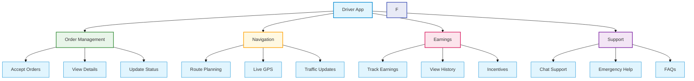
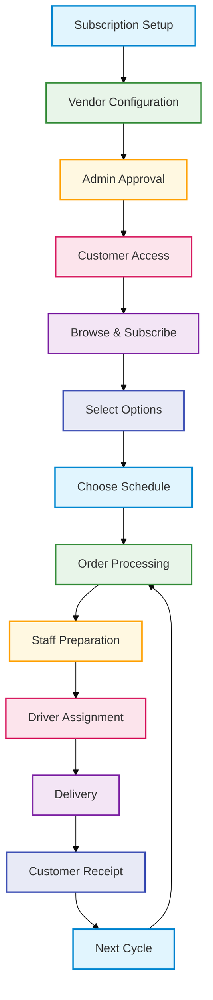

 
 

# SUBSCART DOCUMENTATION

Version 1.0 | March 2025

## Table of Contents

1. [Overview](#overview)
2. [Vendor Module](#1-vendor-module)
3. [Customer Module](#2-customer-module)
4. [Staff Module](#3-staff-module)
5. [Delivery Driver Module](#4-delivery-driver-module)
6. [Conclusion](#conclusion)

## Overview

### Subscart Platform

![[platform_overview.jpg]]

Subscart is a cutting-edge subscription management platform designed to seamlessly connect vendors and customers in one ecosystem. From food subscriptions to flexible delivery options, we are redefining how subscriptions are created, managed, and delivered.

### Why Subscart?

![[why_subscart.jpg]]

The subscription economy is expanding rapidly, but managing subscriptions remains a complex and fragmented experience for both businesses and customers. Many vendors struggle with setting up and managing flexible subscriptions, while customers face difficulties in modifying, pausing, or customizing their plans. Subscart simplifies this process by offering an all-in-one platform that streamlines subscription management, delivery, and customer interaction.

### Market Gap & Opportunity

![[market_gap.jpg]]

<table>
<tr>
<th align="center">Challenge</th>
<th align="center">Subscart Solution</th>
</tr>
<tr>
<td align="center">1️⃣ Lack of Integration</td>
<td>
• End-to-end solution for all stakeholders 
• Unified platform for subscription, payment, and delivery 
• Seamless communication between modules
</td>
</tr>
<tr>
<td align="center">2️⃣ Rigid Models</td>
<td>
• Flexible subscription modifications 
• Pause/resume functionality 
• Customizable delivery options
</td>
</tr>
<tr>
<td align="center">3️⃣ High Costs</td>
<td>
• Cost-effective platform for small businesses 
• Minimal initial investment 
• Scalable infrastructure
</td>
</tr>
<tr>
<td align="center">4️⃣ Poor Delivery</td>
<td>
• Real-time tracking 
• Optimized routes 
• Efficient delivery management
</td>
</tr>
</table>

### Registration Process

![[registration.jpg]]

<table>
<tr>
<th align="center">Vendor Registration</th>
<th align="center">Customer Registration</th>
</tr>
<tr>
<td>
1. Complete registration form 
2. Submit for admin approval 
3. Receive approval notification 
4. Set up outlet profile 
5. Configure delivery options 
6. Start creating subscriptions
</td>
<td>
1. Sign up with basic details 
2. Verify contact information 
3. Set delivery preferences 
4. Browse available outlets 
5. Subscribe to plans 
6. Manage subscriptions
</td>
</tr>
</table>

### Core Workflow

### Key Stakeholders

#### Platform Roles

![[stakeholders.jpg]]

<table>
<tr>
<th align="center">Role</th>
<th align="center">Responsibilities</th>
</tr>
<tr>
<td align="center">Vendors</td>
<td>
• Create and manage subscription plans 
• Handle deliveries and payments 
• Track customer engagement
</td>
</tr>
<tr>
<td align="center">Customers</td>
<td>
• Browse and subscribe to plans 
• Customize delivery preferences 
• Manage active subscriptions
</td>
</tr>
<tr>
<td align="center">Staff</td>
<td>
• Oversee order preparation 
• Manage inventory 
• Ensure quality control
</td>
</tr>
<tr>
<td align="center">Drivers</td>
<td>
• Handle timely deliveries 
• Follow optimized routes 
• Update delivery status
</td>
</tr>
</table>

### Platform Advantages

#### Key Benefits

![[advantages.jpg]]

<table>
<tr>
<th align="center">Feature</th>
<th align="center">Benefits</th>
</tr>
<tr>
<td align="center">Vendor Management</td>
<td>
• Effortless subscription creation 
• Automated payment processing 
• Integrated delivery tracking
</td>
</tr>
<tr>
<td align="center">Customer Experience</td>
<td>
• Flexible subscription control 
• Easy plan modifications 
• Reduced subscription churn
</td>
</tr>
<tr>
<td align="center">Optimized Logistics</td>
<td>
• Streamlined order fulfillment 
• Real-time delivery updates 
• Efficient route planning
</td>
</tr>
<tr>
<td align="center">Business Scalability</td>
<td>
• Cost-effective solution 
• Market expansion tools 
• Growth-ready infrastructure
</td>
</tr>
</table>

## 1. Vendor Module

### Vendor Management System

The vendor module empowers food service providers to create, manage, and monitor subscription-based meal plans.

### Subscription Types
![[flexible.jpg]]

<table>
<tr>
<th width="50%" align="center">Fixed Subscription</th>
<th width="50%" align="center">Flexible Subscription</th>
</tr>
<tr>
<td>
<ul>
<li>Meal plan remains unchanged throughout subscription</li>
<li>Same meals delivered on scheduled days</li>
<li>Simplified management</li>
<li>Predictable inventory planning</li>
</ul>
</td>
<td>
<ul>
<li>Menu can change for different delivery days</li>
<li>Adaptable to seasonal ingredients</li>
<li>Can be modified even after creation</li>
<li>Greater variety for customers</li>
</ul>
</td>
</tr>
</table>

### Subscription Creation Process
![[product.jpg]]

<table>
<tr>
<th width="5%" align="center">Step</th>
<th width="25%">Action</th>
<th width="70%">Description</th>
</tr>
<tr>
<td align="center">1</td>
<td>Choose Subscription Type</td>
<td>Select either Fixed or Flexible subscription model</td>
</tr>
<tr>
<td align="center">2</td>
<td>Name the Subscription</td>
<td>Assign a descriptive name to the subscription plan</td>
</tr>
<tr>
<td align="center">3</td>
<td>Select Delivery Days</td>
<td>Choose which days of the week meals will be delivered</td>
</tr>
<tr>
<td align="center">4</td>
<td>Assign Products</td>
<td>Select specific meals for each chosen delivery day</td>
</tr>
<tr>
<td align="center">5</td>
<td>Add Optional Add-ons</td>
<td>Configure additional items (beverages, snacks) with quantity limits</td>
</tr>
<tr>
<td align="center">6</td>
<td>Set Duration</td>
<td>Define the subscription period (e.g., 30 days, 60 days)</td>
</tr>
<tr>
<td align="center">7</td>
<td>Choose Delivery Type</td>
<td>Select from delivery options (see below)</td>
</tr>
<tr>
<td align="center">8</td>
<td>Set Preparation Time</td>
<td>Define lead time required before delivery/pickup</td>
</tr>
<tr>
<td align="center">9</td>
<td>Submit for Approval</td>
<td>Send to admin for review and approval</td>
</tr>
</table>

### Delivery Options

<table>
<tr>
<th width="20%" align="center">Option</th>
<th width="80%">Description</th>
</tr>
<tr>
<td align="center">Delivery</td>
<td>Using either Subscart's delivery service (0.5 OMR per delivery) or vendor's own delivery system</td>
</tr>
<tr>
<td align="center">Pickup</td>
<td>Customers collect their meals from the vendor's physical location</td>
</tr>
<tr>
<td align="center">Pickup & Delivery</td>
<td>Customers can choose between pickup or delivery for maximum flexibility</td>
</tr>
</table>

### Delivery Method Implementation

#### Comprehensive Delivery Solutions

Each delivery option follows a specific workflow designed to ensure reliable and efficient order fulfillment:

<table>
<tr>
<th width="25%" align="center">Method</th>
<th width="75%">Process Description</th>
</tr>
<tr>
<td align="center">Subscription Delivery</td>
<td>
<ol>
<li>Customer subscribes to meal plan</li>
<li>System schedules orders automatically</li>
<li>Staff notified 1 hour before delivery</li>
<li>Meals prepared and packed</li>
<li>Delivery agent delivers to registered address</li>
<li>Customer receives at scheduled time</li>
</ol>
</td>
</tr>
<tr>
<td align="center">Vendor Delivery</td>
<td>
<ol>
<li>Customer places order with vendor</li>
<li>Vendor receives notification</li>
<li>Order prepared and packed</li>
<li>Delivery agent picks up order</li>
<li>Order delivered to customer</li>
<li>Customer confirms receipt</li>
</ol>
</td>
</tr>
<tr>
<td align="center">Pickup</td>
<td>
<ol>
<li>Customer selects "Pickup" option</li>
<li>Vendor/staff receives notification</li>
<li>Order prepared and marked ready</li>
<li>Customer receives notification</li>
<li>Customer verifies with QR/ID</li>
<li>Vendor hands over order</li>
<li>Order marked complete</li>
</ol>
</td>
</tr>
<tr>
<td align="center">Pickup & Delivery</td>
<td>
<ol>
<li>Customer chooses method</li>
<li>Vendor processes order</li>
<li>Order prepared</li>
<li>For pickup: Counter placement</li>
<li>For delivery: Agent assignment</li>
<li>Customer receives/collects</li>
<li>Order completion</li>
</ol>
</td>
</tr>
<tr>
<td align="center">Subscription P&D</td>
<td>
<ol>
<li>Customer creates subscription</li>
<li>System generates schedule</li>
<li>Staff notified before prep</li>
<li>Meals prepared and packed</li>
<li>Pickup: Counter placement</li>
<li>Delivery: Agent delivers</li>
<li>Customer collects/receives</li>
</ol>
</td>
</tr>
</table>

### Process Flowcharts

#### Detailed Workflow Diagrams

##### 1. Subscription Delivery

##### 2. Vendor Delivery

##### 3. Pickup

##### 4. Pickup & Delivery Combination

## 2. Customer Module

The customer module provides a streamlined interface for browsing, purchasing, and managing meal subscriptions.

### Subscription Journey

<table> <tr> <th width="33%">Discovery Phase</th> <th width="33%">Purchase Phase</th> <th width="33%">Management Phase</th> </tr> <tr> <td> <ol> <li>Browse available meal plans</li> <li>View subscription details</li> <li>Check vendor ratings</li> <li>Review meal options</li> </ol> </td> <td> <ol> <li>Select subscription type</li> <li>Choose delivery option</li> <li>Configure add-ons</li> <li>Complete payment</li> </ol> </td> <td> <ol> <li>View active subscriptions</li> <li>Pause/resume as needed</li> <li>Modify products</li> <li>Track upcoming deliveries</li> </ol> </td> </tr> </table>

### Customer Management Features

<table> <tr> <th width="25%">Feature</th> <th width="75%">Description</th> </tr> <tr> <td>Pause Subscription</td> <td>Temporarily halt deliveries without canceling the subscription, ideal for vacations or when meals aren't needed</td> </tr> <tr> <td>Modify Add-ons</td> <td>Adjust optional items within vendor-defined limits to customize the subscription experience</td> </tr> <tr> <td>Cancel Subscription</td> <td>End subscription based on vendor-defined cancellation policies</td> </tr> <tr> <td>Delivery Schedule</td> <td>View calendar of upcoming deliveries with detailed information about each meal</td> </tr> <tr> <td>Payment Management</td> <td>Update payment methods and view billing history</td> </tr> </table> 

## 3. Staff Module

### Staff Operations

The dedicated Staff App streamlines meal preparation workflows for vendor employees.

### Key Features

<table>
<tr>
<th width="25%" align="center">Feature</th>
<th width="75%">Description</th>
</tr>
<tr>
<td align="center">Order Dashboard</td>
<td>Comprehensive view of all upcoming orders sorted by preparation deadline</td>
</tr>
<tr>
<td align="center">Calendar Integration</td>
<td>Visual calendar showing all scheduled preparations to facilitate resource planning</td>
</tr>
<tr>
<td align="center">Preparation Tracking</td>
<td>Mark orders as "In Progress" and "Prepared" to maintain workflow visibility</td>
</tr>
<tr>
<td align="center">Notification System</td>
<td>Automated alerts for upcoming preparation deadlines and special instructions</td>
</tr>
<tr>
<td align="center">Ingredient Management</td>
<td>View required ingredients for upcoming orders to ensure adequate stock</td>
</tr>
</table>

### Staff Workflow

## 4. Delivery Driver Module

### Delivery Operations

The Delivery Driver App manages the final step in the subscription fulfillment process.

### Delivery Workflow

<table>
<tr>
<th align="center">Stage</th>
<th align="center">Action</th>
<th>Details</th>
</tr>
<tr>
<td align="center">1️⃣</td>
<td align="center">Notification</td>
<td>Driver receives notification when staff marks an order as prepared</td>
</tr>
<tr>
<td align="center">2️⃣</td>
<td align="center">Acceptance</td>
<td>Driver reviews order details and accepts the delivery task</td>
</tr>
<tr>
<td align="center">3️⃣</td>
<td align="center">Pickup</td>
<td>Driver navigates to vendor location and confirms pickup</td>
</tr>
<tr>
<td align="center">4️⃣</td>
<td align="center">Delivery</td>
<td>Driver delivers meal to customer location using optimal route</td>
</tr>
<tr>
<td align="center">5️⃣</td>
<td align="center">Completion</td>
<td>Driver marks delivery as complete after customer receipt</td>
</tr>
<tr>
<td align="center">6️⃣</td>
<td align="center">Incentive</td>
<td>Compensation is added to driver's earnings account</td>
</tr>
</table>

### Driver App Features

### Key Features

<table>
<tr>
<th width="25%" align="center">Feature</th>
<th width="75%">Description</th>
</tr>
<tr>
<td align="center">Real-time Updates</td>
<td>Instant notifications for new orders, changes, and delivery status updates</td>
</tr>
<tr>
<td align="center">Smart Navigation</td>
<td>Optimized routing with real-time traffic updates and turn-by-turn directions</td>
</tr>
<tr>
<td align="center">Earnings Tracker</td>
<td>Detailed breakdown of deliveries, earnings, and incentives</td>
</tr>
<tr>
<td align="center">Performance Metrics</td>
<td>Track delivery times, customer ratings, and completion rates</td>
</tr>
<tr>
<td align="center">Support System</td>
<td>24/7 access to customer service and emergency assistance</td>
</tr>
</table>

## Conclusion

### System Overview

Subscart provides a comprehensive solution for subscription-based meal delivery, integrating vendors, customers, staff, and drivers into a seamless ecosystem.

### Key Components

<table>
<tr>
<th width="25%" align="center">Module</th>
<th width="75%">Core Features</th>
</tr>
<tr>
<td align="center">Vendor</td>
<td>
• Subscription plan creation 
• Delivery method configuration 
• Order management
</td>
</tr>
<tr>
<td align="center">Customer</td>
<td>
• Plan browsing and subscription 
• Delivery preferences 
• Subscription management
</td>
</tr>
<tr>
<td align="center">Staff</td>
<td>
• Order preparation 
• Inventory management 
• Quality control
</td>
</tr>
<tr>
<td align="center">Driver</td>
<td>
• Real-time order tracking 
• Route optimization 
• Delivery confirmation
</td>
</tr>
</table>

### Delivery Methods Summary

### System Benefits

<table>
<tr>
<th width="33%" align="center">Business</th>
<th width="33%" align="center">Customer</th>
<th width="33%" align="center">Operations</th>
</tr>
<tr>
<td align="center">
• Recurring revenue 
• Customer retention 
• Market expansion
</td>
<td align="center">
• Convenience 
• Flexibility 
• Reliability
</td>
<td align="center">
• Automation 
• Efficiency 
• Scalability
</td>
</tr>
</table>

### Complete System Integration

### System Integration

#### End-to-End Flow

```mermaid
%%{init: {'theme': 'base', 'themeVariables': { 'primaryColor': '#e1f5fe', 'primaryBorderColor': '#0288d1', 'secondaryColor': '#f3e5f5', 'secondaryBorderColor': '#7b1fa2'}}}%%
graph LR
    A[Vendors create plans] --> B[Customers subscribe]
    B --> C[Staff prepare meals]
    C --> D[Drivers deliver orders]
    D --> E[Customer Receives]
    E --> F[Cycle Repeats]
    F --> B
    
    style A fill:#e1f5fe,stroke:#0288d1,stroke-width:2px
    style B fill:#e8f5e9,stroke:#388e3c,stroke-width:2px
    style C fill:#fff8e1,stroke:#ffa000,stroke-width:2px
    style D fill:#fce4ec,stroke:#d81b60,stroke-width:2px
    style E fill:#f3e5f5,stroke:#7b1fa2,stroke-width:2px
    style F fill:#e8eaf6,stroke:#3f51b5,stroke-width:2px
```

### Implementation Status

<table>
<tr>
<th width="25%" align="center">Phase</th>
<th width="55%" align="center">Status</th>
<th width="20%" align="center">Progress</th>
</tr>
<tr>
<td align="center">Vendor Module</td>
<td>Core functionality complete, testing ongoing</td>
<td align="center">90%</td>
</tr>
<tr>
<td align="center">Customer Module</td>
<td>All features implemented and validated</td>
<td align="center">100%</td>
</tr>
<tr>
<td align="center">Staff Module</td>
<td>Final testing and optimization in progress</td>
<td align="center">85%</td>
</tr>
<tr>
<td align="center">Driver Module</td>
<td>Route optimization enhancements pending</td>
<td align="center">95%</td>
</tr>
</table>

---

### Ready for Launch

The Subscart platform is now prepared to revolutionize subscription-based meal delivery services.

### Subscription Delivery

#### Managed Delivery System

![[subscription_delivery.jpg]]

Our flagship delivery method that provides end-to-end subscription management. For detailed steps on creating and managing subscriptions, see [[Subscart Managed Delivery]].

<table>
<tr>
<th align="center">Feature</th>
<th align="center">Description</th>
</tr>
<tr>
<td align="center">Automated Scheduling</td>
<td>
• Regular delivery slots 
• Flexible timing options 
• Advance scheduling
</td>
</tr>
<tr>
<td align="center">Mobile Management</td>
<td>
• Easy subscription setup 
• Real-time tracking 
• Status updates
</td>
</tr>
<tr>
<td align="center">Vendor Controls</td>
<td>
• Delivery zone setup 
• Lead time configuration 
• Pause management
</td>
</tr>
<tr>
<td align="center">Customer Features</td>
<td>
• Flexible modifications 
• Delivery preferences 
• Order history
</td>
</tr>
</table>

### Process Flow

### Implementation Details

<table>
<tr>
<th align="center">Phase</th>
<th align="center">Actions</th>
</tr>
<tr>
<td align="center">Setup</td>
<td>
• Vendor creates subscription plan 
• Configures delivery options 
• Sets pricing and schedules
</td>
</tr>
<tr>
<td align="center">Approval</td>
<td>
• Admin reviews setup 
• Validates configurations 
• Activates subscription
</td>
</tr>
<tr>
<td align="center">Access</td>
<td>
• Customers view plans 
• Select preferences 
• Choose delivery slots
</td>
</tr>
<tr>
<td align="center">Cycle</td>
<td>
• Automated order creation 
• Staff notification 
• Delivery assignment
</td>
</tr>
</table>

For detailed mobile app workflows and step-by-step guides, refer to [[Subscart Managed Delivery]].

