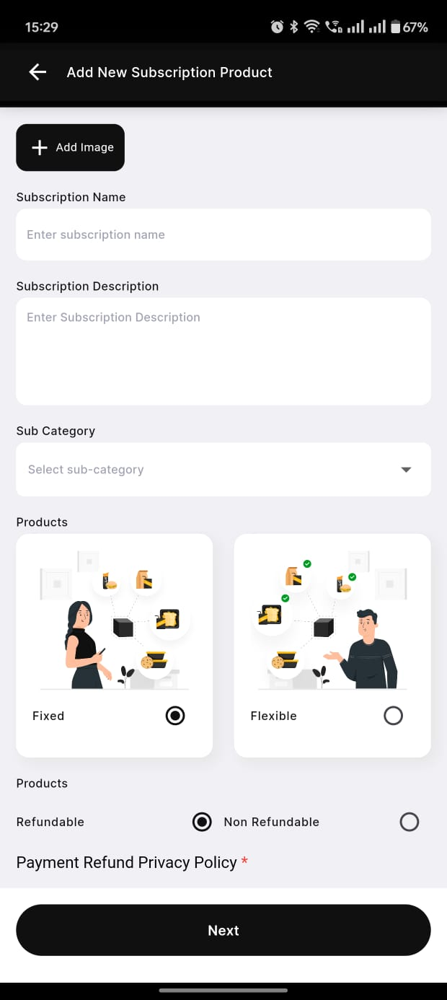
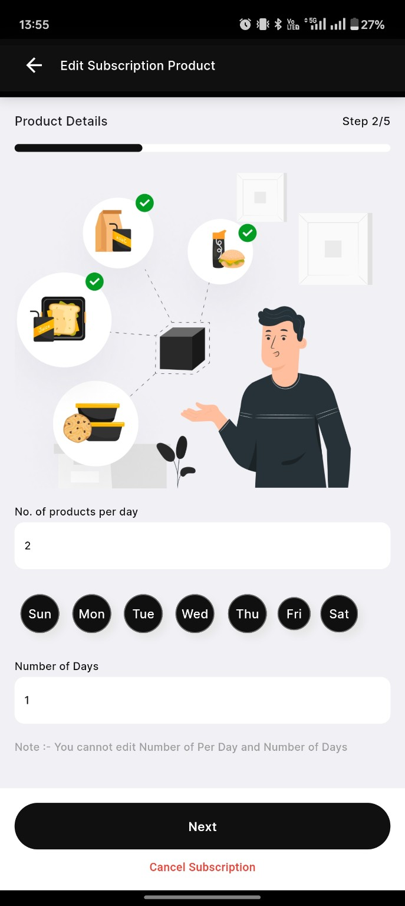
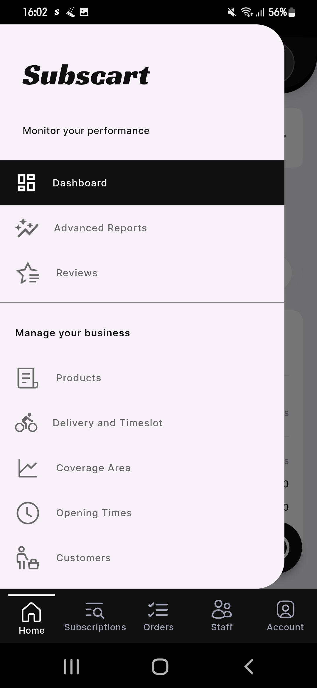

### Step 1: Subscription Creation by Vendor

### ##Step 1: Order Placement

The <strong>Order Placement</strong> screen allows vendors to add new subscription products by filling in the necessary details.

Below are the key fields in the form:

<ul>
  <li><strong>Subscription Name</strong>: A text field where the vendor enters the name of the subscription product.</li>
  <li><strong>Subscription Description</strong>: A text area where a brief description of the subscription product is provided.</li>
  <li><strong>Sub Category</strong>: A dropdown menu for selecting the relevant category under which the subscription falls.</li>
  <li><strong>Products</strong>: Two options are available:
    <ul>
      <li><strong>Fixed</strong>: A predefined product type with set attributes.</li>
      <li><strong>Flexible</strong>: A customizable product type that can have variations.</li>
    </ul>
  </li>
  <li><strong>Refundable Option</strong>: A radio button selection where the vendor can choose whether the product is refundable or non-refundable.</li>
  <li><strong>Payment Refund Privacy Policy</strong>: A mandatory section requiring the vendor to acknowledge the refund policy before proceeding.</li>
</ul>

Once all details are entered, the vendor clicks the <strong>Next</strong> button to proceed.

  

    
  

---

### ##Step 2: Setting the frequency of the products

The <strong>Edit Subscription Product</strong> screen allows vendors to modify product details in an ongoing subscription. This screen helps define the delivery frequency and total duration of the subscription.

<strong>Form Fields:</strong>

<ul>
  <li><strong>No. of products per day:</strong> A numeric input field where vendors specify how many products should be delivered daily.</li>
  <li><strong>Days Selection:</strong> A set of circular buttons representing the days of the week. Vendors can select specific days when the product should be delivered.</li>
  <li><strong>Number of Days:</strong> A numeric input field indicating the number of days one cycle of Subscription Orders.</li>
  <li><strong>Note:</strong> A disclaimer at the bottom states that the vendor cannot edit the number of products per day and the total subscription duration.</li>
</ul>

At the bottom, there are two action buttons:

<ul>
  <li><strong>Next:</strong> Proceeds to the next step in the subscription modification process.</li>
</ul>

  

    
  

---

### ##Step 3: Setting up the products for each days

The <strong>Edit Subscription Product - Make Schedule</strong> screen allows vendors to schedule specific products for each day of the subscription plan.

<strong>Form Fields:</strong>

<ul>
  <li><strong>Day Selection:</strong> Displays the current day being configured (e.g., <strong>Day 1</strong>).</li>
  <li><strong>Product 1:</strong> A dropdown menu where vendors can select the first product for the selected day. The chosen product in this image is <em>Sandwiches - Healthy Lab On-The-Go Egg Toast</em>.</li>
  <li><strong>Swap Option (Product 1):</strong> An additional field that allows vendors to specify an alternative product.</li>
  <li><strong>Product 2:</strong> A dropdown menu where vendors can select the second product for the selected day. The chosen product in this image is <em>Fresh Juices - Super Green Detox Juice</em>.</li>
  <li><strong>Swap Option (Product 2):</strong> An additional field that allows vendors to specify an alternative product.</li>
</ul>

<strong>Action Buttons:</strong>

<ul>
  <li><strong>Next:</strong> Moves to the next step in the subscription scheduling process.</li>
</ul>

  

    
  

---

### ##Step 4: Setting up the validation and add on for the products.

The <strong>Add New Subscription Product</strong> screen enables vendors to create and customize subscription offerings, allowing flexible pricing and optional add-ons.

<strong>Form Fields:</strong>

<ul>
  <li><strong>Number of Days:</strong> Specifies the duration of the subscription (e.g., <strong>30 days</strong>).</li>
  <li><strong>Validity Price:</strong> Sets the total cost for the specified duration (e.g., <strong>OMR 200</strong>).</li>
  <li><strong>Add Variations:</strong> Allows vendors to create multiple pricing or duration options.</li>
  <li><strong>Remove:</strong> Deletes the variation if no longer needed.</li>
</ul>

<strong>Choice Group Details:</strong>

Vendors can offer optional add-ons within the subscription, such as beverages or meal upgrades.

<ul>
  <li><strong>Choice Name:</strong> Defines the name of the add-on category (e.g., <strong>Beverages</strong>).</li>
  <li><strong>Minimum No. of Choices:</strong> The minimum number of selections required (e.g., <strong>0</strong>, meaning optional).</li>
  <li><strong>Maximum No. of Choices:</strong> The maximum number of selections allowed (e.g., <strong>3</strong>, meaning a customer can choose up to three options).</li>
</ul>

Vendors can create multiple <strong>Choice Groups</strong> for further customization, including side dishes, toppings, or combo sets.

<strong>Action Buttons:</strong>

<ul>
  <li><strong>Next:</strong> Proceeds to the next step in the subscription setup.</li>
</ul>

  

    
  

  

    
  

---

### ##Step 5: Choosing Delivery Type

The <strong>Give Customer Options</strong> popup allows vendors to specify how customers can receive their subscription products.

<strong>Options Available:</strong>

<ul>
  <li><strong>Delivery:</strong> Customers will receive their orders via delivery.</li>
  <li><strong>Pick up:</strong> Customers can collect their orders from the vendor's location.</li>
  <li><strong>Pick up & Delivery:</strong> A flexible option allowing both pick-up and delivery to the customer.</li>
</ul>

<strong>Delivery Management Options:</strong>

When vendors select the <strong>Delivery</strong> option, they will be prompted with two important decisions:

<ul>
  <li><strong>Subscart Delivery Management:</strong>
    <ul>
      <li>A prompt appears asking "Do you want Subscart to Fulfill your deliveries?"</li>
      <li>If vendor selects <strong>No</strong>, the subscription automatically becomes a Vendor Managed Delivery</li>
      <li>This means the vendor will be responsible for managing their own delivery logistics</li>
    </ul>
  </li>
  <li><strong>Customer Purchase Availability:</strong>
    <ul>
      <li>After selecting No to Subscart delivery, vendors will be asked if they want to allow customers to purchase subscriptions</li>
      <li>This gives vendors control over subscription availability based on their delivery capacity</li>
      <li>If enabled, vendors must ensure they have the necessary delivery infrastructure in place</li>
    </ul>
  </li>
</ul>

<strong>Vendor Managed Delivery Responsibilities:</strong>

<ul>
  <li>Managing their own delivery fleet or partnering with third-party delivery services</li>
  <li>Setting up delivery zones and time slots based on their capacity</li>
  <li>Handling delivery tracking and customer communication</li>
  <li>Managing delivery-related issues and customer support</li>
</ul>

<strong>Action Buttons:</strong>

<ul>
  <li><strong>Ok:</strong> Confirms the selection.</li>
  <li><strong>Cancel:</strong> Discards the changes.</li>
</ul>

  

    
  

  

    
  

---

### ##Step 5.1: Setting Up Delivery Time Slots

Before customers can select delivery times, vendors must configure their available time slots. This is done through the <strong>Delivery and Timeslot</strong> section in the vendor's management interface:

<strong>Time Slot Configuration:</strong>

<ul>
  <li><strong>Access:</strong>
    <ul>
      <li>Navigate to "Manage your business" section</li>
      <li>Select "Delivery and Timeslot" from the menu</li>
    </ul>
  </li>
  <li><strong>Time Slot Setup:</strong>
    <ul>
      <li>Add delivery slots using the "Add Delivery" button</li>
      <li>For each slot, configure:
        <ul>
          <li><strong>Start Time:</strong> Beginning of delivery window</li>
          <li><strong>End Time:</strong> End of delivery window</li>
        </ul>
      </li>
      <li>Examples of time slots:
        <ul>
          <li>14:10 to 01:10 (longer window)</li>
          <li>16:40 to 16:58 (precise window)</li>
        </ul>
      </li>
    </ul>
  </li>
</ul>

<strong>Important Notes:</strong>

<ul>
  <li>All time slots must be within your business operating hours</li>
  <li>Consider your delivery capacity when setting up slots</li>
  <li>Use the trash icon to remove unwanted slots</li>
  <li>Click Save to apply your changes</li>
</ul>

  

    
  

  

    
  

---

### ##Step 6: Setting up the lead time

The <strong>Lead Time Setup</strong> screen allows vendors to configure important timing parameters for their subscription service.

<strong>Form Fields:</strong>

<ul>
  <li><strong>Lead Time:</strong>
    <ul>
      <li>Specifies how many hours before fulfillment customers can edit their subscription</li>
      <li>In the example, set to <strong>1 hour</strong> before fulfillment</li>
      <li>This gives vendors enough time to prepare for any last-minute changes</li>
    </ul>
  </li>
  <li><strong>Price Per Additional Delivery:</strong>
    <ul>
      <li>Vendors can set a fixed price for any additional delivery requests</li>
      <li>Example shows <strong>OMR 20</strong> per extra delivery</li>
      <li>This fee applies when customers request deliveries outside their regular subscription schedule</li>
    </ul>
  </li>
  <li><strong>Delivery Time Slots:</strong>
    <ul>
      <li>Available time windows for delivery (if delivery option is selected)</li>
      <li>Vendors can set multiple slots based on their delivery capacity</li>
    </ul>
  </li>
  <li><strong>Pickup Time Slots:</strong>
    <ul>
      <li>Available time windows for customer pickup (if pickup option is selected)</li>
      <li>Helps manage customer flow at pickup locations</li>
    </ul>
  </li>
</ul>

<strong>Additional Settings:</strong>

<ul>
  <li><strong>Maximum Pause Duration:</strong> Set the maximum number of days a subscription can be paused</li>
  <li><strong>Outlet Selection:</strong> Choose which outlets will offer this subscription plan</li>
  <li><strong>Delivery Zones:</strong> If managing own delivery, specify the areas where delivery service is available</li>
</ul>

<strong>Subscription Pause Control:</strong>

During the lead time setup, vendors are prompted with an important decision about subscription flexibility:

<ul>
  <li><strong>Pause Feature:</strong>
    <ul>
      <li>A prompt appears asking "Do you want your customer to be able to pause their subscription?"</li>
      <li>Selecting <strong>Yes</strong> allows customers to temporarily pause their subscription when needed</li>
      <li>Selecting <strong>No</strong> means subscriptions will run continuously without pause option</li>
    </ul>
  </li>
  <li><strong>Benefits of Enabling Pause:</strong>
    <ul>
      <li>Provides flexibility to customers during vacations or other commitments</li>
      <li>Reduces subscription cancellations by offering a temporary alternative</li>
      <li>Improves customer satisfaction through better control over their subscription</li>
    </ul>
  </li>
</ul>

<strong>Subscription Pause Configuration:</strong>

When vendors enable the pause feature, they can configure additional settings:

<ul>
  <li><strong>Maximum No. of Days:</strong>
    <ul>
      <li>Vendors can set the maximum number of days a subscription can be paused</li>
      <li>In the example, set to <strong>12 days</strong></li>
      <li>This helps vendors manage their inventory and delivery planning</li>
    </ul>
  </li>
  <li><strong>Delivery Radius:</strong>
    <ul>
      <li>A slider control to set the maximum distance for delivery services</li>
      <li>Helps vendors define their service area based on their delivery capabilities</li>
      <li>Ensures efficient delivery management and reasonable delivery times</li>
    </ul>
  </li>
  <li><strong>Outlets:</strong>
    <ul>
      <li>Vendors can select which outlets will participate in the subscription service</li>
      <li>Shows all available outlets with their complete addresses</li>
      <li>Allows multiple outlet selection for wider coverage</li>
      <li>Each outlet can be individually toggled on/off</li>
    </ul>
  </li>
</ul>

<strong>Example Outlet Display:</strong>

<ul>
  <li>Shows outlet name and complete address</li>
  <li>Checkbox selection for each outlet</li>
  <li>Displays total number of selected outlets (e.g., "All (3)")</li>
</ul>

<strong>Action Buttons:</strong>

<ul>
  <li><strong>Save:</strong> Confirms all pause and delivery settings</li>
</ul>

  

    
  

  

    
  

  

    
  

---

## Step 2: How the Customer Perceives it

### ##Step 7: Customer Purchase Flow

When customers view a vendor-managed delivery subscription, they see a comprehensive overview of the subscription details:

<strong>Subscription Overview:</strong>

<ul>
  <li><strong>Price Display:</strong>
    <ul>
      <li>Clear display of subscription price (e.g., OMR 60)</li>
      <li>Buy Now button shows the total amount</li>
    </ul>
  </li>
  <li><strong>Schedule Selection:</strong>
    <ul>
      <li>Interactive calendar view with days of the week</li>
      <li>Customers can select delivery days (Sun through Sat)</li>
    </ul>
  </li>
  <li><strong>Subscription Details:</strong>
    <ul>
      <li><strong>Product:</strong> Flexible - allowing product variations</li>
      <li><strong>Delivery:</strong> Flexible - customers can adjust delivery preferences</li>
      <li><strong>Delivery By:</strong> Vendor - clearly indicating vendor-managed delivery</li>
      <li><strong>Delivery Type:</strong> Delivery Only</li>
      <li><strong>Lead Time:</strong> 1 Hour - time before which changes can be made</li>
      <li><strong>Maximum Pause Time:</strong> 12 days - maximum duration for subscription pause</li>
    </ul>
  </li>
</ul>

<strong>Meal Plan Preview:</strong>

<ul>
  <li>Visual display of scheduled items (e.g., Orange Juice, Lean Beef Burger)</li>
  <li>Options to skip, swap, or move delivery slots</li>
  <li>Delivery time selection for each order</li>
</ul>

<strong>Action Buttons:</strong>

<ul>
  <li><strong>Buy Now:</strong> Proceeds to purchase with displayed amount</li>
  <li><strong>Information Icons:</strong> Provide additional details for each feature</li>
</ul>

  

    
  

### ##Step 8: Payment Breakdown

When customers proceed to payment, they see a simplified pricing structure for vendor-managed deliveries:

<strong>Payment Breakdown:</strong>

<ul>
  <li><strong>Subscription Price:</strong>
    <ul>
      <li>Shows the total price (e.g., OMR 60) which includes delivery charges</li>
      <li>Unlike Subscart Managed Delivery, there are no separate delivery fees</li>
      <li>Vendors have already factored delivery costs into the subscription price</li>
    </ul>
  </li>
  <li><strong>Price Display:</strong>
    <ul>
      <li>Clear breakdown showing subscription duration (e.g., 2 days)</li>
      <li>Total price matches the subscription price as delivery is included</li>
      <li>All-inclusive pricing makes it simpler for customers to understand the total cost</li>
    </ul>
  </li>
</ul>

<strong>Additional Notes:</strong>

<ul>
  <li>No separate delivery charges are shown as they're built into the subscription price</li>
  <li>The total amount (e.g., OMR 60.000) is what customers will be charged</li>
  <li>Any additional delivery requests will be charged at the rate set by the vendor (as configured in lead time settings)</li>
</ul>

<strong>Action Button:</strong>

<ul>
  <li><strong>Buy Now:</strong> Shows the final price (OMR 60.000) for immediate purchase</li>
</ul>

  

    
  

### ##Step 9: Delivery Schedule Selection

After proceeding with the purchase, customers can select their preferred delivery schedule based on vendor-defined time slots:

<strong>Schedule Selection Interface:</strong>

<ul>
  <li><strong>Month Selection:</strong>
    <ul>
      <li>Visual calendar display showing current and next month</li>
      <li>Navigation arrows to move between months</li>
    </ul>
  </li>
  <li><strong>Delivery Time Slots:</strong>
    <ul>
      <li>Time slots are set by the vendor based on their business hours</li>
      <li>Examples of available slots:
        <ul>
          <li>14:10 to 01:10</li>
          <li>16:40 to 16:58</li>
          <li>17:00 to 18:00</li>
          <li>17:15 to 17:30</li>
        </ul>
      </li>
      <li>Unlike Subscart Managed Delivery, these slots align with the vendor's shop operating hours</li>
    </ul>
  </li>
</ul>

<strong>Key Features:</strong>

<ul>
  <li>Time slots are decided by the vendor based on their delivery capacity</li>
  <li>Slots may vary in duration based on vendor preferences</li>
  <li>All deliveries are scheduled within vendor's business hours</li>
  <li>Multiple slots throughout the day for customer convenience</li>
</ul>

<strong>Action Button:</strong>

<ul>
  <li><strong>Proceed to checkout:</strong> Shows final amount (OMR 60.000) and moves to payment</li>
</ul>

  

    
  

### ##Step 10: Customer Makes Payment

The <strong>Payment Selection</strong> screen allows customers to choose their preferred payment method before proceeding with checkout. This ensures a seamless and secure payment process when purchasing a subscription.

<strong>Key Features:</strong>

<ul>
  <li><strong>Header:</strong>
    <ul>
      <li>Displays "<strong>Select Payment Type</strong>" at the top.</li>
      <li>Includes a back button for easy navigation.</li>
    </ul>
  </li>
  <li><strong>Payment Method:</strong>
    <ul>
      <li>Users can select "<strong>Online (Card)</strong>" as their payment option.</li>
      <li>An icon is displayed next to the payment option for better visual clarity.</li>
      <li>A radio button is used to indicate selection.</li>
    </ul>
  </li>
  <li><strong>Checkout Button:</strong>
    <ul>
      <li>A large black "<strong>Checkout</strong>" button is placed at the bottom.</li>
      <li>Users must select a payment method before proceeding.</li>
    </ul>
  </li>
  <li><strong>Expected Behavior:</strong>
    <ul>
      <li>Clicking "<strong>Checkout</strong>" redirects the user to the payment gateway.</li>
      <li>If no payment method is selected, the button remains inactive.</li>
    </ul>
  </li>
</ul>

  

---

### Step 3: Staff Perception

### ## Step 1: Staff Order Management

When the lead time expires, staff members receive order details in their application:

<strong>Order Information Display:</strong>

<ul>
  <li><strong>Customer Details:</strong>
    <ul>
      <li>Customer Name (e.g., "Aditya Pandey")</li>
      <li>Order ID (e.g., "SCO.1468301365")</li>
      <li>Delivery Type: Delivery</li>
    </ul>
  </li>
  <li><strong>Order Status:</strong>
    <ul>
      <li>Current status (e.g., "Preparing")</li>
      <li>Managed By: Vendor</li>
      <li>Scheduled delivery time</li>
    </ul>
  </li>
  <li><strong>Location Information:</strong>
    <ul>
      <li>Complete delivery address</li>
      <li>Area and landmark details</li>
      <li>City and state information</li>
    </ul>
  </li>
</ul>

<strong>Product Details:</strong>

<ul>
  <li><strong>Item Information:</strong>
    <ul>
      <li>Product image and name</li>
      <li>Nutritional information:
        <ul>
          <li>Fat content: 27 gm</li>
          <li>Protein: 55 gm</li>
          <li>Carbohydrates: 74 gm</li>
        </ul>
      </li>
      <li>Product Choices option available</li>
    </ul>
  </li>
  <li><strong>Status Options:</strong>
    <ul>
      <li>Preparing</li>
      <li>Ready</li>
      <li>In Delivery</li>
    </ul>
  </li>
</ul>

<strong>QR Code Scanner:</strong>

<ul>
  <li>Scan button in bottom-right corner</li>
  <li>Used for order verification</li>
  <li>Updates order status in real-time</li>
</ul>

  

    
  

### ## Step 2: Order Completion Process

When the vendor's driver reaches the customer's location, the final verification and completion process begins:

<strong>Delivery Verification:</strong>

<ul>
  <li><strong>QR Code Process:</strong>
    <ul>
      <li>Driver requests customer to show QR code</li>
      <li>Uses scan button to verify order</li>
      <li>System validates order details instantly</li>
    </ul>
  </li>
  <li><strong>Order Details Display:</strong>
    <ul>
      <li>Customer name and order ID</li>
      <li>Delivery address confirmation</li>
      <li>Product details and specifications</li>
    </ul>
  </li>
</ul>

<strong>Completion Steps:</strong>

<ul>
  <li><strong>After Successful Scan:</strong>
    <ul>
      <li>Order status updates to "Delivered"</li>
      <li>Success confirmation screen appears</li>
      <li>Customer receives delivery notification</li>
    </ul>
  </li>
  <li><strong>System Updates:</strong>
    <ul>
      <li>Delivery marked as complete</li>
      <li>Subscription cycle updates automatically</li>
      <li>Next delivery date calculated</li>
    </ul>
  </li>
</ul>

<strong>Post-Delivery Actions:</strong>

<ul>
  <li>Customer can rate the delivery experience</li>
  <li>Digital receipt generated</li>
  <li>Order moves to completed orders section</li>
  <li>Subscription status remains active for future deliveries</li>
</ul>

